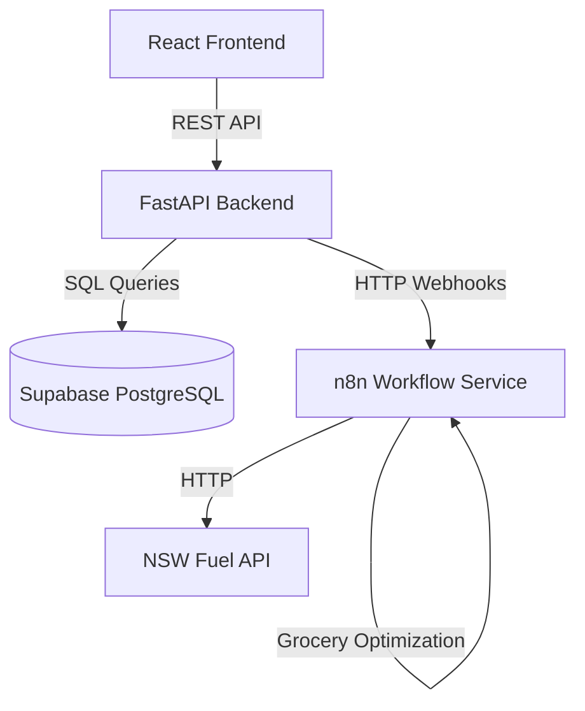
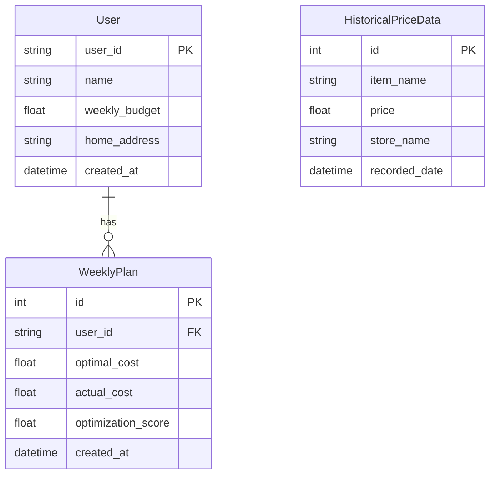

# Design Document: Budget Optimization Backend

## Overview

The Budget Optimization Backend is a FastAPI-based REST API that serves university students seeking to optimize their weekly budgets. The system follows a three-layer architecture (routers, services, models) and delegates complex optimization tasks to an external n8n workflow service. The backend maintains responsibility for user management, data persistence in Supabase PostgreSQL, historical price analysis, and leaderboard calculations.

The system is designed for rapid MVP development with a clear separation between real functionality (leaderboard, database operations, n8n integration) and demo-friendly features (historical price predictions using 4 weeks of seeded data).

## Architecture

### High-Level Architecture



### Three-Layer Architecture

1. **Router Layer** (`routers/`)
   - Handles HTTP request/response
   - Input validation using Pydantic models
   - Route definitions and OpenAPI documentation
   - No business logic

2. **Service Layer** (`services/`)
   - All business logic
   - External service integration (n8n)
   - Data transformation and calculations
   - Database operations orchestration

3. **Model Layer** (`models/`)
   - SQLAlchemy ORM models for database tables
   - Pydantic schemas for request/response validation
   - Data transfer objects

### Technology Stack

- **Framework**: FastAPI 0.104+
- **Database**: Supabase (PostgreSQL)
- **ORM**: SQLAlchemy 2.0+
- **Validation**: Pydantic v2
- **HTTP Client**: httpx (async)
- **Environment**: Python 3.11+

## Components and Interfaces

### 1. Router Components

#### User Router (`routers/user.py`)

```python
@router.post("/onboard", status_code=201)
async def onboard_user(user_data: UserOnboardRequest) -> UserResponse:
    """
    Create a new user account.

    Args:
        user_data: Contains name, weekly_budget, home_address

    Returns:
        UserResponse with user_id and created user details

    Raises:
        HTTPException 400: Invalid input data
        HTTPException 500: Database error
    """
```

#### Grocery Router (`routers/grocery.py`)

```python
@router.post("/optimise/groceries", status_code=200)
async def optimize_groceries(request: GroceryOptimizationRequest) -> GroceryOptimizationResponse:
    """
    Optimize grocery shopping with price predictions.

    Args:
        request: Contains user_id and grocery_list (array of item names)

    Returns:
        GroceryOptimizationResponse with optimal_cost, store_recommendations,
        and item_breakdown with price predictions

    Raises:
        HTTPException 400: Invalid input
        HTTPException 503: n8n service unavailable
    """
```

#### Transport Router (`routers/transport.py`)

```python
@router.post("/transport/compare", status_code=200)
async def compare_transport(request: TransportComparisonRequest) -> TransportComparisonResponse:
    """
    Compare fuel costs at nearby petrol stations.

    Args:
        request: Contains user_id, destination, fuel_amount_needed

    Returns:
        TransportComparisonResponse with sorted list of stations by total cost

    Raises:
        HTTPException 400: Invalid input
        HTTPException 503: n8n service unavailable
    """
```

#### Weekly Plan Router (`routers/weekly_plan.py`)

```python
@router.post("/weekly-plan/record", status_code=201)
async def record_weekly_plan(request: WeeklyPlanRequest) -> WeeklyPlanResponse:
    """
    Record actual spending for a week.

    Args:
        request: Contains user_id, optimal_cost, actual_cost

    Returns:
        WeeklyPlanResponse with calculated optimization_score

    Raises:
        HTTPException 400: Invalid input
        HTTPException 500: Database error
    """
```

#### Leaderboard Router (`routers/leaderboard.py`)

```python
@router.get("/leaderboard", status_code=200)
async def get_leaderboard() -> LeaderboardResponse:
    """
    Get ranked leaderboard of users by average optimization score.

    Returns:
        LeaderboardResponse with ranked list of users

    Raises:
        HTTPException 500: Database error
    """
```

### 2. Service Components

#### User Service (`services/user_service.py`)

```python
async def create_user(name: str, weekly_budget: float, home_address: str) -> User:
    """
    Create and persist a new user.

    Validates input, creates User record in database.

    Args:
        name: Non-empty string
        weekly_budget: Positive number
        home_address: Non-empty string

    Returns:
        Created User object with generated user_id

    Raises:
        ValueError: Invalid input data
        DatabaseError: Database operation failed
    """

async def get_user_by_id(user_id: str) -> User:
    """
    Retrieve user by ID.

    Args:
        user_id: User identifier

    Returns:
        User object

    Raises:
        NotFoundError: User does not exist
    """
```

#### Grocery Service (`services/grocery_service.py`)

```python
async def optimize_groceries(user_id: str, grocery_list: list[str]) -> GroceryOptimizationResult:
    """
    Optimize grocery shopping with price predictions.

    Process:
    1. Fetch user's home_address
    2. Call n8n webhook with grocery_list and home_address
    3. Receive optimization results from n8n
    4. Enrich each item with price prediction
    5. Return enriched results

    Args:
        user_id: User identifier
        grocery_list: List of item names

    Returns:
        GroceryOptimizationResult with predictions

    Raises:
        NotFoundError: User not found
        ServiceUnavailableError: n8n service failed
    """

async def enrich_with_price_predictions(items: list[GroceryItem]) -> list[GroceryItem]:
    """
    Add price prediction tags to grocery items.

    For each item:
    1. Query historical prices (past 4 weeks)
    2. Calculate 4-week average
    3. Compare current price to average
    4. Tag: "likely to drop next week" if below average
    5. Tag: "historically rising" if at/above average

    Args:
        items: List of grocery items with current prices

    Returns:
        Items enriched with price_prediction field
    """
```

#### Transport Service (`services/transport_service.py`)

```python
async def compare_transport_costs(
    user_id: str,
    destination: str,
    fuel_amount_needed: float
) -> TransportComparisonResult:
    """
    Compare fuel costs at nearby petrol stations.

    Process:
    1. Fetch user's home_address (origin)
    2. Call n8n webhook to get nearby stations with NSW Fuel API data
    3. For each station, calculate:
       - Distance from home
       - Fuel cost to reach station
       - Fuel cost at station (fuel_amount_needed * price_per_liter)
       - Total cost = cost_to_reach + fuel_cost_at_station
    4. Sort by total_cost ascending

    Args:
        user_id: User identifier
        destination: Destination address (for context)
        fuel_amount_needed: Liters of fuel needed

    Returns:
        TransportComparisonResult with sorted stations

    Raises:
        NotFoundError: User not found
        ServiceUnavailableError: n8n service failed
    """
```

#### Weekly Plan Service (`services/weekly_plan_service.py`)

```python
async def record_weekly_plan(
    user_id: str,
    optimal_cost: float,
    actual_cost: float
) -> WeeklyPlan:
    """
    Record weekly spending and calculate optimization score.

    Process:
    1. Fetch user's weekly_budget
    2. Calculate optimization_score = (weekly_budget - actual_cost) / weekly_budget
    3. Create WeeklyPlan record with timestamp
    4. Persist to database

    Args:
        user_id: User identifier
        optimal_cost: Optimal cost from grocery optimization
        actual_cost: Amount user actually spent

    Returns:
        Created WeeklyPlan with calculated score

    Raises:
        NotFoundError: User not found
        DatabaseError: Database operation failed
    """
```

#### Leaderboard Service (`services/leaderboard_service.py`)

```python
async def calculate_leaderboard() -> list[LeaderboardEntry]:
    """
    Calculate and return ranked leaderboard.

    Process:
    1. Query all WeeklyPlan records grouped by user_id
    2. Calculate average optimization_score for each user
    3. Exclude users with no WeeklyPlan records
    4. Sort by average_score descending
    5. Assign ranks (1, 2, 3, ...)
    6. Join with User table to get usernames

    Returns:
        List of LeaderboardEntry objects sorted by rank

    SQL Query:
    SELECT
        u.user_id,
        u.name as username,
        AVG(wp.optimization_score) as average_score,
        RANK() OVER (ORDER BY AVG(wp.optimization_score) DESC) as rank
    FROM users u
    INNER JOIN weekly_plans wp ON u.user_id = wp.user_id
    GROUP BY u.user_id, u.name
    HAVING COUNT(wp.id) > 0
    ORDER BY average_score DESC
    """
```

#### Historical Price Service (`services/historical_price_service.py`)

```python
async def get_historical_average(item_name: str) -> float | None:
    """
    Calculate 4-week average price for an item.

    Args:
        item_name: Name of grocery item

    Returns:
        Average price over past 4 weeks, or None if no data

    SQL Query:
    SELECT AVG(price) as avg_price
    FROM historical_price_data
    WHERE item_name = ?
      AND recorded_date >= NOW() - INTERVAL '4 weeks'
    """

async def seed_demo_data() -> None:
    """
    Seed database with 4 weeks of demo historical price data.

    Creates realistic price variations for 5 common items:
    - Milk (1L)
    - Bread (Loaf)
    - Eggs (Dozen)
    - Chicken Breast (1kg)
    - Rice (1kg)

    For each item, creates 28 records (4 weeks * 7 days) with:
    - Random price variations (±10% from base price)
    - Multiple stores (Coles, Woolworths, Aldi)
    - Realistic timestamps
    """
```

#### n8n Integration Service (`services/n8n_service.py`)

```python
async def call_n8n_webhook(
    webhook_url: str,
    payload: dict,
    timeout: int = 30
) -> dict:
    """
    Generic n8n webhook caller with error handling.

    Args:
        webhook_url: Full n8n webhook URL
        payload: JSON payload to send
        timeout: Request timeout in seconds (default 30)

    Returns:
        JSON response from n8n

    Raises:
        ServiceUnavailableError: n8n unreachable or returned non-200
        TimeoutError: Request exceeded timeout

    Implementation:
    - Uses httpx.AsyncClient
    - Sets timeout
    - Logs request/response
    - Handles connection errors
    - Validates response status
    """
```

### 3. Data Models

#### Database Models (`models/db_models.py`)

```python
class User(Base):
    __tablename__ = "users"

    user_id: Mapped[str] = mapped_column(String, primary_key=True)
    name: Mapped[str] = mapped_column(String, nullable=False)
    weekly_budget: Mapped[float] = mapped_column(Float, nullable=False)
    home_address: Mapped[str] = mapped_column(String, nullable=False)
    created_at: Mapped[datetime] = mapped_column(DateTime, default=datetime.utcnow)

    weekly_plans: Mapped[list["WeeklyPlan"]] = relationship(back_populates="user")

class WeeklyPlan(Base):
    __tablename__ = "weekly_plans"

    id: Mapped[int] = mapped_column(Integer, primary_key=True, autoincrement=True)
    user_id: Mapped[str] = mapped_column(String, ForeignKey("users.user_id"), nullable=False)
    optimal_cost: Mapped[float] = mapped_column(Float, nullable=False)
    actual_cost: Mapped[float] = mapped_column(Float, nullable=False)
    optimization_score: Mapped[float] = mapped_column(Float, nullable=False)
    created_at: Mapped[datetime] = mapped_column(DateTime, default=datetime.utcnow)

    user: Mapped["User"] = relationship(back_populates="weekly_plans")

class HistoricalPriceData(Base):
    __tablename__ = "historical_price_data"

    id: Mapped[int] = mapped_column(Integer, primary_key=True, autoincrement=True)
    item_name: Mapped[str] = mapped_column(String, nullable=False, index=True)
    price: Mapped[float] = mapped_column(Float, nullable=False)
    store_name: Mapped[str] = mapped_column(String, nullable=False)
    recorded_date: Mapped[datetime] = mapped_column(DateTime, nullable=False, index=True)
```

#### Pydantic Schemas (`models/schemas.py`)

```python
class UserOnboardRequest(BaseModel):
    name: str = Field(..., min_length=1)
    weekly_budget: float = Field(..., gt=0)
    home_address: str = Field(..., min_length=1)

class UserResponse(BaseModel):
    user_id: str
    name: str
    weekly_budget: float
    home_address: str
    created_at: datetime

class GroceryOptimizationRequest(BaseModel):
    user_id: str
    grocery_list: list[str] = Field(..., min_length=1)

class GroceryItem(BaseModel):
    item_name: str
    current_price: float
    store_name: str
    price_prediction: str | None = None  # "likely to drop next week" or "historically rising"

class GroceryOptimizationResponse(BaseModel):
    optimal_cost: float
    store_recommendations: list[str]
    item_breakdown: list[GroceryItem]

class TransportComparisonRequest(BaseModel):
    user_id: str
    destination: str = Field(..., min_length=1)
    fuel_amount_needed: float = Field(..., gt=0)

class PetrolStation(BaseModel):
    station_name: str
    address: str
    distance_from_home: float  # km
    price_per_liter: float
    cost_to_reach_station: float
    fuel_cost_at_station: float
    total_cost: float

class TransportComparisonResponse(BaseModel):
    stations: list[PetrolStation]  # Sorted by total_cost ascending

class WeeklyPlanRequest(BaseModel):
    user_id: str
    optimal_cost: float = Field(..., ge=0)
    actual_cost: float = Field(..., gt=0)

class WeeklyPlanResponse(BaseModel):
    id: int
    user_id: str
    optimal_cost: float
    actual_cost: float
    optimization_score: float
    created_at: datetime

class LeaderboardEntry(BaseModel):
    user_id: str
    username: str
    average_score: float
    rank: int

class LeaderboardResponse(BaseModel):
    leaderboard: list[LeaderboardEntry]
```

## Data Models

### Entity Relationship Diagram



### Database Indexes

```sql
-- Users table
CREATE UNIQUE INDEX idx_users_user_id ON users(user_id);

-- Weekly Plans table
CREATE INDEX idx_weekly_plans_user_id ON weekly_plans(user_id);
CREATE INDEX idx_weekly_plans_created_at ON weekly_plans(created_at);

-- Historical Price Data table
CREATE INDEX idx_historical_price_item_name ON historical_price_data(item_name);
CREATE INDEX idx_historical_price_recorded_date ON historical_price_data(recorded_date);
CREATE INDEX idx_historical_price_item_date ON historical_price_data(item_name, recorded_date);
```

## Correctness Properties

_A property is a characteristic or behavior that should hold true across all valid executions of a system—essentially, a formal statement about what the system should do. Properties serve as the bridge between human-readable specifications and machine-verifiable correctness guarantees._

### Property 1: User Creation Round Trip

_For any_ valid user data (name, weekly_budget, home_address), creating a user via POST /onboard should persist the user to the database, and querying the database should return a user with the same data and a generated user_id.

**Validates: Requirements 1.1, 1.5, 1.7**

### Property 2: Weekly Budget Validation

_For any_ number, when creating a user, only positive numbers should be accepted as weekly_budget, and non-positive numbers (zero, negative) should be rejected with a 400 status code.

**Validates: Requirements 1.2**

### Property 3: Name Validation

_For any_ string, when creating a user, only non-empty strings should be accepted as name, and empty or whitespace-only strings should be rejected with a 400 status code.

**Validates: Requirements 1.3**

### Property 4: Home Address Validation

_For any_ string, when creating a user, only non-empty strings should be accepted as home_address, and empty or whitespace-only strings should be rejected with a 400 status code.

**Validates: Requirements 1.4**

### Property 5: Validation Error Response Format

_For any_ invalid input to any endpoint, the API should return a 400 status code with field-specific error messages in a consistent JSON format.

**Validates: Requirements 1.6, 11.1**

### Property 6: Grocery Optimization n8n Integration

_For any_ valid user_id and grocery_list, calling POST /optimise/groceries should forward the request to n8n with the user's home_address included in the payload.

**Validates: Requirements 2.1, 2.2**

### Property 7: Price Prediction Enrichment

_For any_ grocery optimization result from n8n, each item should be enriched with a price_prediction field based on historical data.

**Validates: Requirements 2.3, 2.7**

### Property 8: Historical Price Query Time Range

_For any_ item, when enriching with price predictions, the system should query Historical_Price_Data for exactly the past 4 weeks.

**Validates: Requirements 2.4, 8.2**

### Property 9: Price Below Average Prediction

_For any_ grocery item where current_price < 4-week average price, the price_prediction should be "likely to drop next week".

**Validates: Requirements 2.5**

### Property 10: Price At or Above Average Prediction

_For any_ grocery item where current_price >= 4-week average price, the price_prediction should be "historically rising".

**Validates: Requirements 2.6**

### Property 11: Grocery List Validation

_For any_ array, when calling POST /optimise/groceries, only non-empty arrays should be accepted as grocery_list, and empty arrays should be rejected with a 400 status code.

**Validates: Requirements 2.8**

### Property 12: External Service Error Handling

_For any_ endpoint that calls n8n, when n8n fails (timeout, unreachable, non-200 status), the API should return a 503 status code with a descriptive error message.

**Validates: Requirements 2.9, 3.7, 6.3, 6.4, 11.4**

### Property 13: Transport Comparison n8n Integration

_For any_ valid user_id, destination, and fuel_amount_needed, calling POST /transport/compare should request petrol station data from n8n with the user's home_address as origin.

**Validates: Requirements 3.1, 3.2**

### Property 14: Total Cost Calculation

_For any_ petrol station data from n8n, the total_cost for each station should equal (cost_to_reach_station + fuel_amount_needed \* price_per_liter_at_station).

**Validates: Requirements 3.3, 3.4**

### Property 15: Station Sorting by Total Cost

_For any_ list of petrol stations, the transport comparison response should order stations by total_cost in ascending order (cheapest first).

**Validates: Requirements 3.6**

### Property 16: Fuel Amount Validation

_For any_ number, when calling POST /transport/compare, only positive numbers should be accepted as fuel_amount_needed, and non-positive numbers should be rejected with a 400 status code.

**Validates: Requirements 3.8**

### Property 17: Weekly Plan Persistence with Score Calculation

_For any_ valid user_id, optimal_cost, and actual_cost, recording a weekly plan should persist all fields to the database with optimization_score calculated as (weekly_budget - actual_cost) / weekly_budget.

**Validates: Requirements 4.1, 4.2, 4.3, 4.4**

### Property 18: Actual Cost Validation

_For any_ number, when recording a weekly plan, only positive numbers should be accepted as actual_cost, and non-positive numbers should be rejected with a 400 status code.

**Validates: Requirements 4.6**

### Property 19: Leaderboard Calculation and Ranking

_For any_ set of users with weekly plans, the leaderboard should calculate average optimization_score for each user, exclude users with no plans, and order results by average_score descending with correct rank assignments.

**Validates: Requirements 5.1, 5.2, 5.3, 5.5, 5.6**

### Property 20: n8n Request Format

_For any_ call to n8n, the request should use HTTP POST method with JSON-formatted body.

**Validates: Requirements 6.1, 6.5**

### Property 21: n8n Response Validation

_For any_ response from n8n, the API should validate the response structure before processing, and reject invalid responses with appropriate error handling.

**Validates: Requirements 6.6**

### Property 22: User ID Uniqueness

_For any_ two user creation attempts with the same user_id, the second attempt should be rejected due to unique constraint violation.

**Validates: Requirements 7.2**

### Property 23: Foreign Key Integrity

_For any_ weekly plan creation attempt with a non-existent user_id, the creation should be rejected due to foreign key constraint violation.

**Validates: Requirements 7.3**

### Property 24: Database Error Handling

_For any_ database operation failure, the API should return a 500 status code with an error message, and should retry connection failures once before failing.

**Validates: Requirements 7.4, 7.6**

### Property 25: Transaction Atomicity

_For any_ database operation, all changes should be committed atomically (all-or-nothing).

**Validates: Requirements 7.5**

### Property 26: Historical Price Data Persistence

_For any_ historical price record, all fields (item_name, price, store_name, recorded_date) should be persisted to the database with accurate timestamps.

**Validates: Requirements 8.1, 8.7**

### Property 27: Historical Average Calculation

_For any_ item with historical price data, the 4-week average should be the mean of all price values across all stores within the time range.

**Validates: Requirements 8.3**

### Property 28: Resource Not Found Error Handling

_For any_ request for a non-existent resource (e.g., user_id that doesn't exist), the API should return a 404 status code with a descriptive message.

**Validates: Requirements 11.2**

### Property 29: Internal Error Handling

_For any_ internal error, the API should return a 500 status code, log the full error details, and never expose internal implementation details or stack traces to clients.

**Validates: Requirements 11.3, 11.6**

### Property 30: Consistent Error Response Format

_For any_ error response, the API should use a consistent JSON format with error_code and message fields.

**Validates: Requirements 11.5**

## Error Handling

### Error Response Format

All error responses follow a consistent JSON structure:

```json
{
  "error_code": "VALIDATION_ERROR",
  "message": "Descriptive error message",
  "details": {
    "field": "specific field error"
  }
}
```

### Error Codes

- **VALIDATION_ERROR** (400): Input validation failed
- **NOT_FOUND** (404): Resource does not exist
- **INTERNAL_ERROR** (500): Internal server error
- **SERVICE_UNAVAILABLE** (503): External service (n8n) unavailable
- **DATABASE_ERROR** (500): Database operation failed

### Error Handling Strategy

1. **Input Validation**: Use Pydantic models for automatic validation
2. **Database Errors**: Catch SQLAlchemy exceptions, log details, return generic 500
3. **External Service Errors**: Catch httpx exceptions, return 503 with service name
4. **Not Found Errors**: Return 404 for missing resources
5. **Logging**: Log all errors with full stack traces server-side
6. **Security**: Never expose internal details, stack traces, or database errors to clients

### Retry Logic

- **Database connections**: Retry once on connection failure
- **n8n webhooks**: No automatic retry (fail fast, return 503)

## Testing Strategy

### Dual Testing Approach

The system requires both unit tests and property-based tests for comprehensive coverage:

- **Unit tests**: Verify specific examples, edge cases, and integration points
- **Property tests**: Verify universal properties across all inputs

### Property-Based Testing

**Library**: Use `hypothesis` for Python property-based testing

**Configuration**:

- Minimum 100 iterations per property test
- Each test tagged with: **Feature: budget-optimization-backend, Property {number}: {property_text}**

**Property Test Coverage**:

- All 30 correctness properties must be implemented as property-based tests
- Each property test should generate random valid inputs
- Tests should verify the property holds for all generated inputs

**Example Property Test Structure**:

```python
from hypothesis import given, strategies as st
import pytest

@given(
    name=st.text(min_size=1),
    weekly_budget=st.floats(min_value=0.01, max_value=10000),
    home_address=st.text(min_size=1)
)
def test_property_1_user_creation_round_trip(name, weekly_budget, home_address):
    """
    Feature: budget-optimization-backend, Property 1: User Creation Round Trip

    For any valid user data, creating a user should persist to database
    and querying should return the same data.
    """
    # Create user
    response = client.post("/onboard", json={
        "name": name,
        "weekly_budget": weekly_budget,
        "home_address": home_address
    })

    assert response.status_code == 201
    user_id = response.json()["user_id"]

    # Query database
    user = db.query(User).filter(User.user_id == user_id).first()

    assert user is not None
    assert user.name == name
    assert user.weekly_budget == weekly_budget
    assert user.home_address == home_address
```

### Unit Testing

**Focus Areas**:

- Specific examples demonstrating correct behavior
- Edge cases (e.g., negative optimization scores, no historical data)
- Integration between components
- Error conditions with specific inputs
- Demo data seeding verification

**Example Unit Tests**:

```python
def test_negative_optimization_score():
    """Test that spending over budget results in negative score"""
    user = create_test_user(weekly_budget=100)

    response = client.post("/weekly-plan/record", json={
        "user_id": user.user_id,
        "optimal_cost": 80,
        "actual_cost": 120  # Over budget
    })

    assert response.status_code == 201
    assert response.json()["optimization_score"] < 0

def test_no_historical_data_no_prediction():
    """Test that items without history get no prediction tag"""
    # Create item with no historical data
    result = enrich_with_price_predictions([
        GroceryItem(item_name="Unknown Item", current_price=5.0, store_name="Coles")
    ])

    assert result[0].price_prediction is None

def test_seed_demo_data():
    """Test that demo data seeding creates 4 weeks of data for 5 items"""
    seed_demo_data()

    items = ["Milk (1L)", "Bread (Loaf)", "Eggs (Dozen)", "Chicken Breast (1kg)", "Rice (1kg)"]

    for item in items:
        records = db.query(HistoricalPriceData).filter(
            HistoricalPriceData.item_name == item
        ).all()

        assert len(records) >= 28  # At least 4 weeks of daily data

        # Verify date range
        dates = [r.recorded_date for r in records]
        date_range = max(dates) - min(dates)
        assert date_range.days >= 27  # At least 4 weeks
```

### Integration Testing

**Test Scenarios**:

1. Full user onboarding → grocery optimization → weekly plan recording → leaderboard flow
2. n8n webhook integration with mocked n8n service
3. Database transaction rollback on errors
4. Concurrent user operations

### Test Environment

- **Database**: Use separate test Supabase project or local PostgreSQL
- **n8n Mocking**: Use `respx` or similar to mock n8n webhook responses
- **Test Data**: Generate realistic test data with factories
- **Cleanup**: Reset database between test runs

### Coverage Goals

- **Line coverage**: Minimum 80%
- **Property coverage**: 100% (all 30 properties tested)
- **Edge case coverage**: All identified edge cases tested
- **Error path coverage**: All error conditions tested

## Implementation Notes

### Demo vs Production Features

**Fully Implemented (Production-Ready)**:

- User onboarding and persistence
- n8n webhook integration
- Leaderboard calculation
- Database operations with Supabase
- Error handling and validation
- OpenAPI documentation

**Demo-Friendly (Simplified)**:

- Historical price predictions (4 weeks of seeded data, simple average comparison)
- Price prediction messaging ("likely to drop" vs "historically rising")
- Limited to 5 common grocery items for demo

**Future Enhancements** (Not in MVP):

- Real-time price scraping
- Machine learning price predictions
- Multi-store optimization depth
- Historical price trend visualization
- User notifications for price drops

### Configuration

**Environment Variables**:

```
SUPABASE_URL=https://your-project.supabase.co
SUPABASE_KEY=your-anon-key
N8N_GROCERY_WEBHOOK_URL=https://your-n8n.app/webhook/grocery
N8N_TRANSPORT_WEBHOOK_URL=https://your-n8n.app/webhook/transport
N8N_TIMEOUT=30
```

### Deployment Considerations

- **FastAPI**: Deploy on Vercel, Railway, or similar
- **Supabase**: Use hosted Supabase (free tier sufficient for MVP)
- **n8n**: Self-hosted or n8n.cloud
- **CORS**: Configure for React frontend domain
- **Rate Limiting**: Consider adding rate limiting for production

### Performance Considerations

- **Database Queries**: Use indexes on user_id, item_name, recorded_date
- **Leaderboard**: Cache leaderboard results (refresh every 5 minutes)
- **Historical Queries**: Limit to 4 weeks to keep queries fast
- **n8n Timeout**: 30 seconds to prevent long waits

### Security Considerations

- **Input Validation**: Pydantic models validate all inputs
- **SQL Injection**: SQLAlchemy ORM prevents SQL injection
- **Error Messages**: Never expose internal details
- **Environment Variables**: Never commit credentials
- **CORS**: Restrict to known frontend domains
