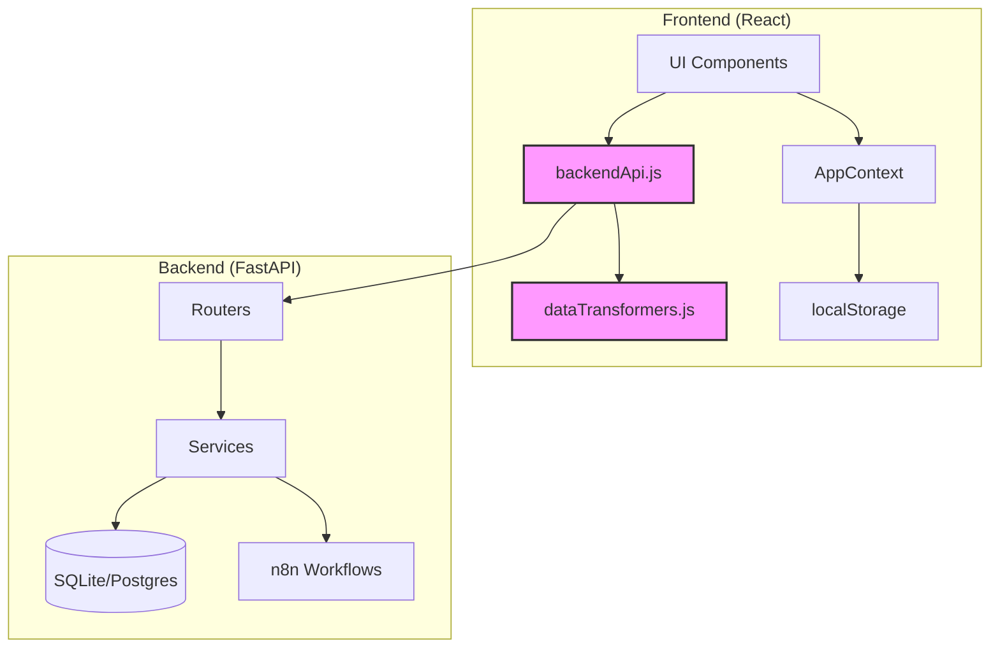

# Design Document: Frontend-Backend Integration

## Overview

This design specifies the integration layer between the React Frontend (koko-app) and the FastAPI Backend. The integration follows a phased approach that connects user onboarding, grocery optimization, weekly plan recording, and leaderboard features while maintaining graceful degradation when the Backend is unavailable.

The design prioritizes:

- **Graceful degradation**: Frontend continues working when Backend is down
- **Backward compatibility**: No breaking changes to existing Frontend features
- **Centralized API management**: Single source of truth for Backend communication
- **Data transformation**: Clean conversion between Frontend and Backend formats
- **Comprehensive error handling**: User-friendly messages for all error scenarios

## Architecture

### System Components



### Integration Layer

The integration layer consists of two new utility modules:

1. **backendApi.js**: Centralized API client for all Backend communication
   - Handles HTTP requests to Backend endpoints
   - Manages error responses and status codes
   - Provides environment-based URL configuration
   - Returns consistent error objects for Frontend handling

2. **dataTransformers.js**: Data format conversion utilities
   - Converts Frontend Shopping_List objects to Backend string arrays
   - Transforms Backend optimization_score to Frontend XP
   - Maps Backend leaderboard data to Frontend format
   - Ensures type safety and data integrity

### Data Flow

**User Onboarding Flow:**

```
Registration Form → backendApi.onboardUser() → Backend /onboard
                                                      ↓
AppContext.userPreferences.userId ← user_id ← Backend Response
```

**Grocery Optimization Flow:**

```
Shopping List → dataTransformers.toBackendGroceryList() → Backend /optimise/groceries
                                                                  ↓
Results Page ← Display optimization data ← Backend Response
```

**Weekly Plan Recording Flow:**

```
Shopping Trip → backendApi.recordWeeklyPlan() → Backend /weekly-plan/record
                                                        ↓
AppContext.xp ← dataTransformers.scoreToXp() ← optimization_score
```

## Components and Interfaces

### 1. Backend API Client (backendApi.js)

**Location:** `Frontend/koko-app/src/utils/backendApi.js`

**Purpose:** Centralized module for all Backend API communication with consistent error handling.

**Configuration:**

```javascript
const BACKEND_URL = import.meta.env.VITE_BACKEND_URL || "http://localhost:8000";
```

**Functions:**

#### onboardUser(name, weeklyBudget, homeAddress)

```javascript
/**
 * Register a new user with the Backend
 * @param {string} name - User's full name
 * @param {number} weeklyBudget - Weekly budget in dollars
 * @param {string} homeAddress - User's home address
 * @returns {Promise<{success: boolean, userId?: string, error?: object}>}
 */
async function onboardUser(name, weeklyBudget, homeAddress)
```

**Request Format:**

```json
{
  "name": "John Smith",
  "weekly_budget": 150.0,
  "home_address": "123 University Ave, Sydney NSW 2000"
}
```

**Success Response:**

```json
{
  "success": true,
  "userId": "usr_abc123def456"
}
```

**Error Response:**

```json
{
  "success": false,
  "error": {
    "type": "VALIDATION_ERROR",
    "message": "weekly_budget must be greater than 0",
    "details": {}
  }
}
```

#### optimizeGroceries(userId, groceryList)

```javascript
/**
 * Get grocery optimization with price predictions
 * @param {string} userId - User identifier from onboarding
 * @param {Array<string>} groceryList - Array of grocery item names
 * @returns {Promise<{success: boolean, data?: object, error?: object}>}
 */
async function optimizeGroceries(userId, groceryList)
```

**Request Format:**

```json
{
  "user_id": "usr_abc123def456",
  "grocery_list": ["Milk (1L)", "Bread (Loaf)", "Eggs (Dozen)"]
}
```

**Success Response:**

```json
{
  "success": true,
  "data": {
    "optimal_cost": 12.5,
    "store_recommendations": ["Woolworths", "Coles"],
    "item_breakdown": [
      {
        "item_name": "Milk (1L)",
        "current_price": 3.5,
        "store_name": "Woolworths",
        "price_prediction": "likely to drop next week"
      }
    ]
  }
}
```

#### recordWeeklyPlan(userId, optimalCost, actualCost)

```javascript
/**
 * Record weekly spending and get optimization score
 * @param {string} userId - User identifier from onboarding
 * @param {number} optimalCost - Optimal cost from grocery optimization
 * @param {number} actualCost - Amount actually spent
 * @returns {Promise<{success: boolean, data?: object, error?: object}>}
 */
async function recordWeeklyPlan(userId, optimalCost, actualCost)
```

**Request Format:**

```json
{
  "user_id": "usr_abc123def456",
  "optimal_cost": 85.5,
  "actual_cost": 92.3
}
```

**Success Response:**

```json
{
  "success": true,
  "data": {
    "id": 1,
    "user_id": "usr_abc123def456",
    "optimal_cost": 85.5,
    "actual_cost": 92.3,
    "optimization_score": 0.926,
    "created_at": "2024-01-15T10:30:00Z"
  }
}
```

#### fetchLeaderboard()

```javascript
/**
 * Fetch leaderboard rankings from Backend
 * @returns {Promise<{success: boolean, data?: Array, error?: object}>}
 */
async function fetchLeaderboard()
```

**Success Response:**

```json
{
  "success": true,
  "data": {
    "leaderboard": [
      {
        "user_id": "usr_abc123",
        "username": "John Smith",
        "average_score": 0.926,
        "rank": 1
      }
    ]
  }
}
```

**Error Handling:**

All functions follow a consistent error handling pattern:

1. **Network Errors** (fetch fails):

   ```javascript
   {
     success: false,
     error: {
       type: "NETWORK_ERROR",
       message: "Unable to connect to the server. Please check your internet connection.",
       details: {}
     }
   }
   ```

2. **404 Not Found**:

   ```javascript
   {
     success: false,
     error: {
       type: "NOT_FOUND",
       message: "User not found. Please register again.",
       details: {}
     }
   }
   ```

3. **503 Service Unavailable**:

   ```javascript
   {
     success: false,
     error: {
       type: "SERVICE_UNAVAILABLE",
       message: "The optimization service is temporarily unavailable. Please try again later.",
       details: {}
     }
   }
   ```

4. **400 Validation Error**:
   ```javascript
   {
     success: false,
     error: {
       type: "VALIDATION_ERROR",
       message: "Invalid input data",
       details: {
         field: "grocery_list",
         message: "grocery_list cannot be empty"
       }
     }
   }
   ```

### 2. Data Transformers (dataTransformers.js)

**Location:** `Frontend/koko-app/src/utils/dataTransformers.js`

**Purpose:** Convert data between Frontend and Backend formats.

**Functions:**

#### toBackendGroceryList(frontendShoppingList)

```javascript
/**
 * Convert Frontend shopping list to Backend format
 * @param {Array<{id: string, name: string, icon: string, quantity: number, price?: number}>} frontendShoppingList
 * @returns {Array<string>} Array of item names
 */
function toBackendGroceryList(frontendShoppingList) {
  return frontendShoppingList.map((item) => item.name);
}
```

**Example:**

```javascript
// Input (Frontend format)
[
  { id: "milk", name: "Milk", icon: "Milk", quantity: 2, price: 3.5 },
  { id: "bread", name: "Bread", icon: "Croissant", quantity: 1, price: 4.0 }
][
  // Output (Backend format)
  ("Milk", "Bread")
];
```

#### scoreToXp(optimizationScore)

```javascript
/**
 * Convert Backend optimization score to Frontend XP
 * @param {number} optimizationScore - Backend score (0.0 to 1.0)
 * @returns {number} XP value (0 to 1000)
 */
function scoreToXp(optimizationScore) {
  return Math.round(optimizationScore * 1000);
}
```

**Example:**

```javascript
scoreToXp(0.926); // Returns: 926
scoreToXp(0.5); // Returns: 500
scoreToXp(1.0); // Returns: 1000
```

#### toFrontendLeaderboard(backendLeaderboard)

```javascript
/**
 * Convert Backend leaderboard to Frontend format
 * @param {Array<{user_id: string, username: string, average_score: number, rank: number}>} backendLeaderboard
 * @returns {Array<{username: string, score: number, weeklyBudget: number, weeklySpend: number}>}
 */
function toFrontendLeaderboard(backendLeaderboard) {
  return backendLeaderboard.map((entry) => ({
    username: entry.username,
    score: Math.round(entry.average_score * 1000), // Convert to XP scale
    weeklyBudget: 0, // Not available from Backend
    weeklySpend: 0 // Not available from Backend
  }));
}
```

**Example:**

```javascript
// Input (Backend format)
[
  {
    user_id: "usr_abc123",
    username: "John Smith",
    average_score: 0.926,
    rank: 1
  }
][
  // Output (Frontend format)
  {
    username: "John Smith",
    score: 926,
    weeklyBudget: 0,
    weeklySpend: 0
  }
];
```

### 3. AppContext Updates

**Location:** `Frontend/koko-app/src/context/AppContext.jsx`

**Changes Required:**

Add `userId` field to `userPreferences`:

```javascript
const [userPreferences, setUserPreferences] = useState({
  name: "",
  budget: 0,
  transportPreference: "",
  userId: null // NEW: Backend user identifier
});
```

**Persistence:**

The `userId` will be automatically persisted to localStorage through the existing `saveState` mechanism in AppContext.

### 4. Registration Page Integration

**Location:** `Frontend/koko-app/src/pages/Registration.jsx`

**Changes Required:**

1. Add `homeAddress` field to registration form
2. Call `backendApi.onboardUser()` on form submission
3. Store returned `userId` in AppContext
4. Handle errors gracefully with fallback to local-only mode

**Form Fields:**

- Name (existing)
- Weekly Budget (existing)
- Home Address (NEW)
- Transport Preference (existing)

**Submission Flow:**

```javascript
async function handleSubmit(formData) {
  // 1. Call Backend API
  const result = await backendApi.onboardUser(
    formData.name,
    formData.budget,
    formData.homeAddress
  );

  // 2. Handle success
  if (result.success) {
    setUserPreferences({
      name: formData.name,
      budget: formData.budget,
      transportPreference: formData.transportPreference,
      userId: result.userId // Store Backend user ID
    });
    navigate("/dashboard");
  }

  // 3. Handle error - continue with local-only mode
  else {
    console.error("Backend onboarding failed:", result.error);
    setUserPreferences({
      name: formData.name,
      budget: formData.budget,
      transportPreference: formData.transportPreference,
      userId: null // No Backend ID, local-only mode
    });
    navigate("/dashboard");
    // Optionally show a toast: "Running in offline mode"
  }
}
```

### 5. Shop Page Chat Integration

**Location:** `Frontend/koko-app/src/pages/Shop.jsx`

**Current Implementation:**

The Shop page uses a chat-based interface where users interact with an AI assistant (via n8n webhook) to build their shopping list. The chat interface:

- Supports text input and voice recording
- Sends messages to n8n webhook for natural language processing
- Updates shopping list based on n8n responses
- Provides a "Calculate my savings" button that navigates to Results page

**Integration Point:**

The chat interface already handles shopping list creation through n8n. The Backend integration should NOT modify this flow. Instead, the Backend integration happens at the Results page when the user clicks "Calculate my savings".

**No Changes Required to Shop Page:**

The Shop page chat interface remains unchanged. Users continue to:

1. Chat with the AI assistant to build their list
2. Use voice or text input
3. Get n8n-powered responses
4. Click "Calculate my savings" to proceed to Results

### 6. Results Page Integration

**Location:** `Frontend/koko-app/src/pages/Results.jsx`

**Changes Required:**

1. Add "Get Backend Optimization" button (optional feature)
2. Call `backendApi.optimizeGroceries()` when button is clicked
3. Display Backend optimization data alongside Frontend calculations
4. Fallback to Frontend-only calculations if Backend unavailable
5. Call `backendApi.recordWeeklyPlan()` on shopping trip submission

**UI Components:**

**Get Backend Optimization Button (Optional):**

```javascript
{
  userPreferences.userId && (
    <button onClick={handleGetBackendOptimization}>
      Get AI Price Predictions
    </button>
  );
}
```

**Optimization Display:**

```javascript
{
  backendOptimizationData && (
    <div className="backend-optimization-results">
      <h3>AI-Powered Optimization</h3>
      <p className="optimal-cost">
        Optimal Cost: ${backendOptimizationData.optimal_cost.toFixed(2)}
      </p>
      <p className="stores">
        Recommended Stores:{" "}
        {backendOptimizationData.store_recommendations.join(", ")}
      </p>

      <h4>Price Predictions:</h4>
      {backendOptimizationData.item_breakdown.map((item) => (
        <div key={item.item_name} className="item-prediction">
          <p className="item-name">{item.item_name}</p>
          <p className="price">
            ${item.current_price} at {item.store_name}
          </p>
          {item.price_prediction && (
            <p className="prediction-badge">{item.price_prediction}</p>
          )}
        </div>
      ))}
    </div>
  );
}
```

**Backend Optimization Flow (Optional Feature):**

```javascript
async function handleGetBackendOptimization() {
  // 1. Check if user has Backend ID
  if (!userPreferences.userId) {
    showToast("Register to unlock AI price predictions");
    return;
  }

  // 2. Transform shopping list
  const backendList = dataTransformers.toBackendGroceryList(shoppingList);

  // 3. Call Backend API
  const result = await backendApi.optimizeGroceries(
    userPreferences.userId,
    backendList
  );

  // 4. Handle success
  if (result.success) {
    setBackendOptimizationData(result.data);
    showToast("AI predictions loaded!");
  }

  // 5. Handle error - continue with Frontend calculations
  else {
    console.error("Backend optimization failed:", result.error);
    showToast("Using local calculations (Backend unavailable)");
  }
}
```

**Shopping Trip Submission Flow (Primary Integration Point):**

```javascript
async function handleSubmitTrip(actualCost) {
  // 1. Calculate Frontend XP (existing logic - MUST KEEP)
  const frontendXp = calculateXpFromSavings(actualCost);
  setXp(xp + frontendXp);

  // 2. Record in Backend if user is registered
  if (userPreferences.userId) {
    // Use Backend optimization cost if available, otherwise use Frontend calculated cost
    const optimalCost =
      backendOptimizationData?.optimal_cost ||
      calculateOptimalCost(shoppingList);

    const result = await backendApi.recordWeeklyPlan(
      userPreferences.userId,
      optimalCost,
      actualCost
    );

    if (result.success) {
      // Add Backend XP on top of Frontend XP
      const backendXp = dataTransformers.scoreToXp(
        result.data.optimization_score
      );
      setXp(xp + frontendXp + backendXp);
      showToast(`+${backendXp} bonus XP from optimization!`);
    }
    // If Backend fails, silently continue with Frontend-only XP
  }

  // 3. Continue with Frontend flow (MUST KEEP)
  updateHistory(actualCost);
  navigate("/dashboard");
}
```

**Key Design Decisions:**

1. **Chat Interface Unchanged**: The n8n-powered chat for building shopping lists remains the primary UX
2. **Backend as Enhancement**: Backend optimization is an optional enhancement, not a replacement
3. **Dual XP System**: Users earn Frontend XP (always) + Backend XP (bonus when registered)
4. **Graceful Degradation**: If Backend fails, Frontend calculations continue seamlessly

### 7. Leaderboard Page Integration

**Location:** `Frontend/koko-app/src/pages/Leaderboard.jsx`

**Changes Required:**

1. Add toggle to switch between Frontend and Backend leaderboards
2. Fetch Backend leaderboard data
3. Transform and display Backend data
4. Show both scoring systems side-by-side

**UI Components:**

**Leaderboard Toggle:**

```javascript
<div className="leaderboard-toggle">
  <button
    className={source === "frontend" ? "active" : ""}
    onClick={() => setSource("frontend")}
  >
    Local Leaderboard
  </button>
  <button
    className={source === "backend" ? "active" : ""}
    onClick={() => setSource("backend")}
  >
    Global Leaderboard
  </button>
</div>
```

**Leaderboard Display:**

```javascript
{
  source === "backend" && backendLeaderboard && (
    <div className="leaderboard-list">
      {backendLeaderboard.map((entry, index) => (
        <div key={index} className="leaderboard-entry">
          <span className="rank">#{index + 1}</span>
          <span className="username">{entry.username}</span>
          <span className="score">{entry.score} XP</span>
        </div>
      ))}
    </div>
  );
}
```

**Data Fetching Flow:**

```javascript
async function loadBackendLeaderboard() {
  const result = await backendApi.fetchLeaderboard();

  if (result.success) {
    const transformed = dataTransformers.toFrontendLeaderboard(
      result.data.leaderboard
    );
    setBackendLeaderboard(transformed);
  } else {
    console.error("Leaderboard fetch failed:", result.error);
    showToast("Global leaderboard unavailable");
  }
}
```

## Data Models

### Frontend Data Models

**Shopping List Item:**

```javascript
{
  id: string,           // Unique identifier (e.g., "milk")
  name: string,         // Display name (e.g., "Milk")
  icon: string,         // Icon name (e.g., "Milk")
  quantity: number,     // Item quantity
  price: number         // Optional price
}
```

**User Preferences:**

```javascript
{
  name: string,                    // User's full name
  budget: number,                  // Weekly budget in dollars
  transportPreference: string,     // "public" or "driving"
  homeAddress: string,             // NEW: User's home address
  userId: string | null            // NEW: Backend user identifier
}
```

**App State:**

```javascript
{
  xp: number,                      // Experience points
  level: number,                   // Calculated from XP
  savings: number,                 // Total savings
  streak: number,                  // Current streak
  shoppingList: Array<ShoppingListItem>,
  history: Array<HistoryEntry>,
  userPreferences: UserPreferences
}
```

### Backend Data Models

**User Onboard Request:**

```javascript
{
  name: string,           // User's full name
  weekly_budget: number,  // Weekly budget (must be > 0)
  home_address: string    // User's home address
}
```

**User Response:**

```javascript
{
  user_id: string,        // Generated user identifier
  name: string,
  weekly_budget: number,
  home_address: string,
  created_at: string      // ISO 8601 timestamp
}
```

**Grocery Optimization Request:**

```javascript
{
  user_id: string,              // User identifier
  grocery_list: Array<string>   // Array of item names
}
```

**Grocery Optimization Response:**

```javascript
{
  optimal_cost: number,
  store_recommendations: Array<string>,
  item_breakdown: Array<{
    item_name: string,
    current_price: number,
    store_name: string,
    price_prediction: string | null
  }>
}
```

**Weekly Plan Request:**

```javascript
{
  user_id: string,
  optimal_cost: number,   // From optimization
  actual_cost: number     // User's actual spending
}
```

**Weekly Plan Response:**

```javascript
{
  id: number,
  user_id: string,
  optimal_cost: number,
  actual_cost: number,
  optimization_score: number,  // 0.0 to 1.0
  created_at: string
}
```

**Leaderboard Response:**

```javascript
{
  leaderboard: Array<{
    user_id: string,
    username: string,
    average_score: number,  // 0.0 to 1.0
    rank: number
  }>
}
```

### Data Transformation Mappings

**Shopping List Transformation:**

```
Frontend → Backend
{id, name, icon, quantity, price} → name (string)

Example:
[{id: "milk", name: "Milk", icon: "Milk", quantity: 2}] → ["Milk"]
```

**Score Transformation:**

```
Backend → Frontend
optimization_score (0.0-1.0) → XP (0-1000)

Example:
0.926 → 926
0.5 → 500
1.0 → 1000
```

**Leaderboard Transformation:**

```
Backend → Frontend
{user_id, username, average_score, rank} → {username, score, weeklyBudget, weeklySpend}

Example:
{
  user_id: "usr_abc",
  username: "John",
  average_score: 0.926,
  rank: 1
}
→
{
  username: "John",
  score: 926,
  weeklyBudget: 0,
  weeklySpend: 0
}
```

## Correctness Properties

A property is a characteristic or behavior that should hold true across all valid executions of a system—essentially, a formal statement about what the system should do. Properties serve as the bridge between human-readable specifications and machine-verifiable correctness guarantees.

### Property 1: Shopping List Transformation Preserves Item Names

_For any_ Frontend shopping list with items, transforming to Backend format should produce an array of strings where each string is the name field from the corresponding Frontend item, in the same order.

**Validates: Requirements 2.6, 6.2**

### Property 2: Optimization Score to XP Conversion is Linear

_For any_ Backend optimization_score between 0.0 and 1.0, converting to Frontend XP should produce a value equal to the score multiplied by 1000 and rounded to the nearest integer.

**Validates: Requirements 3.3, 6.4**

### Property 3: Leaderboard Transformation Preserves User Data

_For any_ Backend leaderboard entry, transforming to Frontend format should preserve the username and convert the average_score to XP scale (multiplied by 1000), while setting weeklyBudget and weeklySpend to 0.

**Validates: Requirements 4.3, 6.6**

### Property 4: API Error Types Map Consistently to HTTP Status Codes

_For any_ Backend API call that returns an HTTP error status, the API client should return an error object where:

- 404 status maps to "NOT_FOUND" type
- 503 status maps to "SERVICE_UNAVAILABLE" type
- 400 status maps to "VALIDATION_ERROR" type
- Network failures map to "NETWORK_ERROR" type

**Validates: Requirements 5.4, 5.5, 5.6, 5.7**

### Property 5: User Registration Stores ID in Both AppContext and localStorage

_For any_ successful Backend onboarding response containing a user_id, the Frontend should store that user_id in both AppContext.userPreferences.userId and localStorage, and both values should be identical.

**Validates: Requirements 1.3, 1.5**

### Property 6: API Calls Include Required Payload Fields

_For any_ Backend API call, the request payload should include all required fields as specified:

- onboardUser: name, weekly_budget, home_address
- optimizeGroceries: user_id, grocery_list
- recordWeeklyPlan: user_id, optimal_cost, actual_cost

**Validates: Requirements 1.2, 2.3, 3.2**

### Property 7: Failed API Calls Enable Graceful Degradation

_For any_ Backend API call that fails (network error, 503, or timeout), the Frontend should:

- Not crash or throw unhandled exceptions
- Continue functioning with Frontend-only features
- Display appropriate user feedback
- Use fallback data when applicable

**Validates: Requirements 1.4, 2.5, 3.5, 4.5, 7.2, 7.4, 7.6**

### Property 8: XP Updates Accumulate Correctly

_For any_ shopping trip submission, if both Frontend and Backend XP calculations succeed, the total XP increase should equal the sum of Frontend XP and Backend XP (Backend optimization_score \* 1000).

**Validates: Requirements 3.4, 3.6**

### Property 9: Environment Configuration Determines Backend URL

_For any_ API client initialization, if VITE_BACKEND_URL is set, all API calls should use that URL; otherwise, they should use the default localhost URL (http://localhost:8000).

**Validates: Requirements 5.3, 8.1, 8.2, 8.4**

### Property 10: Existing Features Remain Functional After Integration

_For any_ existing Frontend feature (gamification, localStorage persistence, n8n integration), the feature should continue to work identically before and after Backend integration, regardless of Backend availability.

**Validates: Requirements 9.1, 9.2, 9.3, 9.5**

### Property 11: localStorage Data Persists Across Sessions

_For any_ user data stored in localStorage (including the new userId field), closing and reopening the app should restore all data exactly as it was, with no data loss.

**Validates: Requirements 9.4**

### Property 12: Validation Errors Display Field-Specific Messages

_For any_ Backend API call that returns a VALIDATION_ERROR with field details, the Frontend should display an error message that references the specific field that failed validation.

**Validates: Requirements 7.3**

### Property 13: NOT_FOUND Errors Trigger Re-registration

_For any_ Backend API call that returns a NOT_FOUND error indicating the user doesn't exist, the Frontend should redirect to the registration page.

**Validates: Requirements 7.1**

### Property 14: Local-Only Mode Maintains Full Gamification

_For any_ user operating in local-only mode (no Backend userId), all gamification features (XP, levels, streaks, savings) should function using Frontend-only calculations.

**Validates: Requirements 7.5**

## Error Handling

### Error Categories

The integration handles four categories of errors:

1. **Network Errors**: Connection failures, timeouts
2. **Client Errors (4xx)**: Invalid requests, missing resources
3. **Server Errors (5xx)**: Backend unavailable, service failures
4. **Validation Errors**: Invalid input data

### Error Handling Strategy

**Principle: Fail Gracefully**

The Frontend should never crash due to Backend failures. All Backend features are optional enhancements to the core Frontend functionality.

**Error Response Format:**

All API client functions return a consistent error structure:

```javascript
{
  success: false,
  error: {
    type: string,        // Error type constant
    message: string,     // User-friendly message
    details: object      // Additional context
  }
}
```

**Error Type Constants:**

```javascript
const ERROR_TYPES = {
  NETWORK_ERROR: "NETWORK_ERROR",
  NOT_FOUND: "NOT_FOUND",
  SERVICE_UNAVAILABLE: "SERVICE_UNAVAILABLE",
  VALIDATION_ERROR: "VALIDATION_ERROR",
  UNKNOWN_ERROR: "UNKNOWN_ERROR"
};
```

### Error Handling by Feature

**User Onboarding:**

- Network Error → Continue with local-only mode, show toast
- Validation Error → Display field errors, allow correction
- Service Unavailable → Continue with local-only mode, show toast

**Grocery Optimization:**

- Network Error → Display mock data, show "offline" notice
- Not Found → Prompt user to re-register
- Service Unavailable → Display mock data, show "Backend unavailable" notice
- Validation Error → Display error message, disable optimization button

**Weekly Plan Recording:**

- Network Error → Continue with Frontend-only XP calculation
- Not Found → Prompt user to re-register
- Service Unavailable → Continue with Frontend-only XP calculation
- Validation Error → Log error, continue with Frontend-only XP

**Leaderboard:**

- Network Error → Show Frontend leaderboard only
- Service Unavailable → Show Frontend leaderboard only, display notice

### User Feedback

**Toast Notifications:**

```javascript
// Success
showToast("Optimization complete!", "success");

// Warning
showToast("Running in offline mode", "warning");

// Error
showToast("Backend unavailable. Using estimated prices.", "error");
```

**Inline Error Messages:**

```javascript
// Validation errors
<div className="error-message">
  {error.type === "VALIDATION_ERROR" &&
    error.details.field === "home_address" && (
      <p>Please enter a valid home address</p>
    )}
</div>
```

**Fallback UI States:**

```javascript
// Backend unavailable
{
  !backendAvailable && (
    <div className="notice">
      <p>Global features unavailable. Using local data.</p>
    </div>
  );
}
```

### Retry Logic

**No Automatic Retries:**

The integration does not implement automatic retry logic. Users can manually retry by:

- Refreshing the page
- Clicking the action button again
- Re-submitting the form

**Rationale:**

- Simplifies implementation
- Avoids cascading failures
- Gives users control
- Backend failures are typically persistent (service down, not transient)

### Logging

**Console Logging:**

All errors are logged to the console for debugging:

```javascript
console.error("Backend API Error:", {
  endpoint: "/onboard",
  error: error,
  timestamp: new Date().toISOString()
});
```

**Production Considerations:**

In production, consider:

- Sending errors to a monitoring service (e.g., Sentry)
- Tracking error rates by endpoint
- Alerting on high error rates
- Removing verbose console logs

## Testing Strategy

### Dual Testing Approach

The integration requires both unit tests and property-based tests for comprehensive coverage:

**Unit Tests:**

- Specific examples of data transformations
- Edge cases (empty lists, null values, boundary conditions)
- Error scenarios (network failures, invalid responses)
- Integration points between components
- UI interactions (button clicks, form submissions)

**Property-Based Tests:**

- Universal properties that hold for all inputs
- Data transformation correctness across random inputs
- Error handling consistency across all error types
- State management invariants
- API contract compliance

### Property-Based Testing Configuration

**Library:** fast-check (JavaScript property-based testing library)

**Configuration:**

- Minimum 100 iterations per property test
- Each test tagged with feature name and property number
- Tag format: `Feature: frontend-backend-integration, Property N: [property text]`

**Example Property Test:**

```javascript
import fc from "fast-check";
import { toBackendGroceryList } from "../utils/dataTransformers";

describe("Property 1: Shopping List Transformation", () => {
  it("should preserve item names in order", () => {
    // Feature: frontend-backend-integration, Property 1: Shopping List Transformation Preserves Item Names
    fc.assert(
      fc.property(
        fc.array(
          fc.record({
            id: fc.string(),
            name: fc.string(),
            icon: fc.string(),
            quantity: fc.nat(),
            price: fc.option(fc.float())
          })
        ),
        (shoppingList) => {
          const result = toBackendGroceryList(shoppingList);

          // Result should be array of strings
          expect(Array.isArray(result)).toBe(true);
          expect(result.every((item) => typeof item === "string")).toBe(true);

          // Should have same length
          expect(result.length).toBe(shoppingList.length);

          // Should preserve names in order
          result.forEach((name, index) => {
            expect(name).toBe(shoppingList[index].name);
          });
        }
      ),
      { numRuns: 100 }
    );
  });
});
```

### Unit Testing Focus Areas

**Data Transformers:**

- Empty array handling
- Null/undefined handling
- Special characters in names
- Very large numbers
- Boundary values (0, 1, 1000 for scores)

**API Client:**

- Mock Backend responses
- Network timeout simulation
- Invalid JSON responses
- Missing required fields
- HTTP status code handling

**Component Integration:**

- Form submission with valid data
- Form submission with invalid data
- Button click handlers
- State updates after API calls
- localStorage synchronization

**Error Handling:**

- Each error type triggers correct behavior
- Error messages display correctly
- Fallback data is used appropriately
- App remains functional after errors

### Test Organization

```
Frontend/koko-app/src/
├── utils/
│   ├── backendApi.js
│   ├── backendApi.test.js          # Unit tests
│   ├── backendApi.property.test.js # Property tests
│   ├── dataTransformers.js
│   ├── dataTransformers.test.js
│   └── dataTransformers.property.test.js
├── pages/
│   ├── Registration.jsx
│   ├── Registration.test.jsx
│   ├── Results.jsx
│   ├── Results.test.jsx
│   ├── Leaderboard.jsx
│   └── Leaderboard.test.jsx
└── context/
    ├── AppContext.jsx
    └── AppContext.test.jsx
```

### Integration Testing

**End-to-End User Flows:**

1. **New User Registration Flow:**
   - Fill registration form
   - Submit with valid data
   - Verify Backend API called
   - Verify userId stored
   - Verify navigation to dashboard

2. **Grocery Optimization Flow:**
   - Create shopping list
   - Navigate to Results
   - Click "Get Optimization"
   - Verify Backend API called
   - Verify optimization data displayed

3. **Shopping Trip Submission Flow:**
   - Complete shopping trip
   - Submit actual cost
   - Verify Backend API called
   - Verify XP updated correctly
   - Verify history updated

4. **Leaderboard Flow:**
   - Navigate to Leaderboard
   - Verify Backend API called
   - Toggle between Frontend/Backend
   - Verify correct data displayed

5. **Offline Mode Flow:**
   - Disconnect Backend
   - Attempt all features
   - Verify graceful degradation
   - Verify fallback data used
   - Verify no crashes

### Test Coverage Goals

- **Unit Test Coverage:** 80%+ for utility functions
- **Integration Test Coverage:** 100% of user flows
- **Property Test Coverage:** All correctness properties implemented
- **Error Scenario Coverage:** All error types tested

### Manual Testing Checklist

- [ ] Registration with Backend available
- [ ] Registration with Backend unavailable
- [ ] Optimization with valid shopping list
- [ ] Optimization with empty shopping list
- [ ] Optimization with Backend unavailable
- [ ] Shopping trip submission with Backend available
- [ ] Shopping trip submission with Backend unavailable
- [ ] Leaderboard with Backend available
- [ ] Leaderboard with Backend unavailable
- [ ] localStorage persistence across sessions
- [ ] Existing features work without Backend
- [ ] All error messages display correctly
- [ ] Fallback data displays correctly
- [ ] No console errors in any scenario
