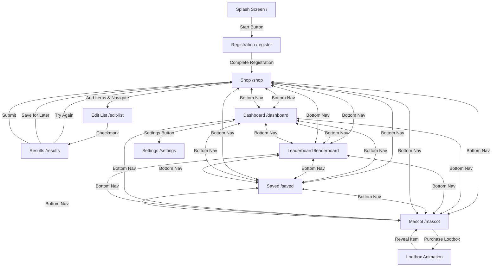

# Design Document: Koko - Gamified Savings App

## Overview

Koko is a React-based mobile web application built with Vite that helps users save money on groceries through gamification. The app uses React Router for navigation and manages shared state through React Context. The design follows Apple's Human Interface Guidelines for mobile experiences with a vibrant purple primary color theme. The app implements an XP (experience points) system where users earn points directly from their savings percentage (10% savings = 10 XP points).

### Technology Stack

- **Frontend Framework**: React 19.2.0
- **Build Tool**: Vite 7.3.1
- **Routing**: React Router v6
- **State Management**: React Context API + useState hooks
- **Styling**: Tailwind CSS with custom purple theme configuration
- **Typography**: Josefin Sans (configured in Tailwind, various weights for hierarchy)
- **Mascot Color**: #9e8fb2 (muted purple for koala, configured as custom color)
- **External Integration**: n8n for chat interface processing

### Tailwind CSS Configuration

```javascript
// tailwind.config.js
export default {
  content: [
    "./index.html",
    "./src/**/*.{js,ts,jsx,tsx}",
  ],
  darkMode: 'class', // Enable class-based dark mode
  theme: {
    extend: {
      colors: {
        primary: '#8B5CF6',      // Vibrant purple
        mascot: '#9e8fb2',       // Muted purple for koala
      },
      fontFamily: {
        sans: ['Josefin Sans', 'system-ui', '-apple-system', 'sans-serif'],
      },
    },
  },
  plugins: [],
}
```

### Key Design Decisions

1. **React Router Navigation**: Using React Router v6 for more powerful routing capabilities, browser history support, and better URL management
2. **Context-based State**: App-level state management using React Context for XP, savings, streaks, and user preferences
3. **XP Points System**: Direct 1:1 mapping where savings percentage equals XP points (10% savings = 10 XP)
4. **Streaks System**: Daily streak counter that increments on savings, breaks on budget overspend, with streak saver purchase option
5. **Customizable Shop Items**: Users can swipe left to remove prefilled items and add custom default items
6. **Mobile-First with Purple Theme**: Vibrant purple primary color following Apple HIG color guidelines
7. **Dark Mode Support**: Theme toggle for light/dark modes
8. **Typography Hierarchy**: Josefin Sans with varying weights (headers: 600-700, body: 400-500)
9. **Level Calculation**: Levels derived from total XP (every 100 XP = 1 level)

## Architecture

### Component Hierarchy

```
App (Root Component)
├── AppContext (State Provider: xp, savings, userPreferences, defaultItems)
├── Router
│   ├── Route: / → SplashScreen
│   ├── Route: /register → Registration
│   ├── Route: /shop → Shop
│   │   └── BottomNavigation
│   ├── Route: /edit-list → EditList (Chat Interface)
│   ├── Route: /results → Results
│   ├── Route: /leaderboard → Leaderboard
│   │   └── BottomNavigation
│   ├── Route: /dashboard → Dashboard
│   │   └── BottomNavigation
│   └── Route: /saved → Saved
│       └── BottomNavigation
```

### Navigation Flow



### State Management Strategy

The App uses React Context to provide global state:
- `xp`: Total experience points earned (number)
- `setXp`: Function to update XP
- `savings`: Total money saved in dollars (number)
- `setSavings`: Function to update savings
- `level`: Calculated from XP (Math.floor(xp / 100) + 1)
- `progress`: Progress toward next level (xp % 100)
- `streak`: Current streak count (number)
- `setStreak`: Function to update streak
- `streakSavers`: Number of streak savers owned (number)
- `setStreakSavers`: Function to update streak savers
- `darkMode`: Boolean for dark mode state
- `setDarkMode`: Function to toggle dark mode
- `userPreferences`: Object containing name, budget, transportPreference
- `setUserPreferences`: Function to update preferences
- `defaultItems`: Array of customizable grocery items for Shop page
- `setDefaultItems`: Function to update default items
- `mascotItems`: Array of owned mascot customization items
- `setMascotItems`: Function to update mascot items
- `equippedItems`: Object containing currently equipped mascot items
- `setEquippedItems`: Function to update equipped items

## Components and Interfaces

### 1. App Component (Root)

**Responsibilities**:
- Set up React Router with route definitions
- Provide AppContext with global state
- Calculate level and progress from XP
- Persist state to localStorage

**Context State**:
```javascript
{
  xp: number,                    // Total experience points (lifetime)
  savings: number,               // Total money saved in dollars
  streak: number,                // Current streak count
  streakSavers: number,          // Number of streak savers owned
  darkMode: boolean,             // Dark mode enabled
  userPreferences: {
    name: string,
    budget: number,
    transportPreference: string  // "public" | "driving"
  },
  defaultItems: Array<{
    id: string,
    name: string,
    icon: string
  }>,
  shoppingList: Array<{
    id: string,
    name: string,
    quantity: number
  }>,
  savedLists: Array<{           // From "Save for Later" button
    id: string,
    items: Array,
    results: Object,
    timestamp: number
  }>,
  history: Array<{              // From "Submit" button
    id: string,
    items: Array,
    results: Object,
    xpEarned: number,
    totalSpent: number,
    timestamp: number
  }>,
  mascotItems: Array<{          // Owned mascot items
    id: string,
    name: string,
    type: string,               // "hat" | "accessory" | "background" | "outfit"
    rarity: string,             // "common" | "rare" | "epic" | "legendary"
    isPremium: boolean,         // True if from lootbox
    imageUrl: string
  }>,
  equippedItems: {              // Currently equipped items
    hat: string | null,         // Item ID
    accessory: string | null,
    background: string | null,
    outfit: string | null
  }
}
```

**Derived Values**:
```javascript
level = Math.floor(xp / 100) + 1
progress = xp % 100

// Weekly XP calculation
const getWeekStart = () => {
  const now = new Date();
  const day = now.getDay();
  const diff = now.getDate() - day + (day === 0 ? -6 : 1);
  return new Date(now.setDate(diff)).setHours(0, 0, 0, 0);
};
const weekStart = getWeekStart();
const weeklyHistory = history.filter(item => item.timestamp >= weekStart);
const weeklyXp = weeklyHistory.reduce((sum, item) => sum + item.xpEarned, 0);
```

### 2. SplashScreen Component

**Route**: `/`

**Props**: None (uses React Router's `useNavigate`)

**UI Elements**:
- Purple Koala mascot image (centered)
- "Start" button (bottom, full-width, vibrant purple)

**Tailwind Classes**:
```jsx
<div className="flex flex-col items-center justify-between min-h-screen bg-white dark:bg-gray-900 p-6">
  <div className="flex-1 flex items-center justify-center">
    
  </div>
  <button className="w-full py-4 bg-primary text-white rounded-xl font-semibold text-lg shadow-lg active:scale-95 transition-transform">
    Start
  </button>
</div>
```

**Behavior**:
- On mount: Display splash screen
- On "Start" click: Navigate to `/register`

### 3. Registration Component

**Route**: `/register`

**Props**: None (uses AppContext and `useNavigate`)

**UI Elements**:
- Text input: Name
- Number input: Budget
- Two-button selector: Transport preference (mutually exclusive)
  - Button 1: "Public Transport"
  - Button 2: "Driving"
- Submit button: "Get Started" (vibrant purple)

**Tailwind Classes**:
```jsx
<div className="min-h-screen bg-white dark:bg-gray-900 p-6">
  <h1 className="text-3xl font-bold text-gray-900 dark:text-white mb-8">Welcome to Koko</h1>
  
  <div className="space-y-6">
    <div>
      <label className="block text-sm font-medium text-gray-700 dark:text-gray-300 mb-2">Name</label>
      <input 
        type="text" 
        className="w-full px-4 py-3 border border-gray-300 dark:border-gray-600 rounded-lg bg-white dark:bg-gray-800 text-gray-900 dark:text-white focus:ring-2 focus:ring-primary focus:border-transparent"
      />
    </div>
    
    <div>
      <label className="block text-sm font-medium text-gray-700 dark:text-gray-300 mb-2">Budget</label>
      <input 
        type="number" 
        className="w-full px-4 py-3 border border-gray-300 dark:border-gray-600 rounded-lg bg-white dark:bg-gray-800 text-gray-900 dark:text-white focus:ring-2 focus:ring-primary focus:border-transparent"
      />
    </div>
    
    <div>
      <label className="block text-sm font-medium text-gray-700 dark:text-gray-300 mb-2">Transport Preference</label>
      <div className="grid grid-cols-2 gap-4">
        <button className="py-3 border-2 border-primary bg-primary text-white rounded-lg font-medium">
          Public Transport
        </button>
        <button className="py-3 border-2 border-gray-300 dark:border-gray-600 text-gray-700 dark:text-gray-300 rounded-lg font-medium">
          Driving
        </button>
      </div>
    </div>
    
    <button className="w-full py-4 bg-primary text-white rounded-xl font-semibold text-lg shadow-lg active:scale-95 transition-transform mt-8">
      Get Started
    </button>
  </div>
</div>
```

**Behavior**:
- Validate inputs (name non-empty, budget > 0, transport selected)
- On submit: Save preferences to context and navigate to `/shop`

**Validation Rules**:
- Name: Required, non-empty string
- Budget: Required, positive number
- Transport: Required, exactly one option selected

### 4. Shop Component

**Route**: `/shop`

**Props**: None (uses AppContext and `useNavigate`)

**UI Elements**:
- Header: Display "Level {level}" with vibrant purple accent
- Grid of grocery cards from `defaultItems`
- Each card: Item name, icon, swipe-left-to-delete gesture
- "+ New default item" card at bottom of grid
- Bottom button: "Start a new list" (full-width, vibrant purple)
- Bottom navigation bar: Dashboard | Saved | Shop | Leaderboard

**Tailwind Classes**:
```jsx
<div className="min-h-screen bg-gray-50 dark:bg-gray-900 pb-24">
  <div className="bg-white dark:bg-gray-800 p-6 shadow-sm">
    <h1 className="text-2xl font-bold text-primary">Level {level}</h1>
  </div>
  
  <div className="p-4">
    <div className="grid grid-cols-2 gap-4">
      {defaultItems.map(item => (
        <div key={item.id} className="bg-white dark:bg-gray-800 rounded-xl p-4 shadow-md active:scale-95 transition-transform">
          <div className="text-4xl mb-2">{item.icon}</div>
          <p className="text-sm font-medium text-gray-900 dark:text-white">{item.name}</p>
        </div>
      ))}
      
      <div className="bg-primary/10 dark:bg-primary/20 rounded-xl p-4 border-2 border-dashed border-primary flex items-center justify-center">
        <span className="text-primary font-medium">+ New Item</span>
      </div>
    </div>
    
    <button className="w-full py-4 bg-primary text-white rounded-xl font-semibold text-lg shadow-lg active:scale-95 transition-transform mt-6">
      Start a new list
    </button>
  </div>
  
  <BottomNavigation />
</div>
```

**Behavior**:
- On card click: Add item to shoppingList
- On card swipe left: Show delete button, remove from defaultItems on confirm
- On "+ New default item" click: Show modal to add custom item (name, icon)
- On "Start a new list": Clear shoppingList, navigate to `/edit-list`
- On bottom nav click: Navigate to respective route

**Default Items Initial State**:
```javascript
const initialDefaultItems = [
  { id: "milk", name: "Milk", icon: "🥛" },
  { id: "eggs", name: "Eggs", icon: "🥚" },
  { id: "bread", name: "Bread", icon: "🍞" },
  { id: "butter", name: "Butter", icon: "🧈" },
  { id: "cheese", name: "Cheese", icon: "🧀" },
  { id: "chicken", name: "Chicken", icon: "🍗" },
  { id: "rice", name: "Rice", icon: "🍚" },
  { id: "pasta", name: "Pasta", icon: "🍝" }
]
```

**Swipe Gesture**:
- Detect touch events for left swipe
- Show red delete button on swipe
- Confirm deletion before removing from defaultItems
- Update context state to persist changes

### 5. EditList Component (Chat Interface)

**Route**: `/edit-list`

**Props**: None (uses AppContext and `useNavigate`)

**UI Elements**:
- Chat message container (scrollable)
- Message input field (bottom)
- Voice input button (records voice and sends to n8n, vibrant purple accent)
- Checkmark button (bottom right, vibrant purple)

**Tailwind Classes**:
```jsx
<div className="flex flex-col h-screen bg-gray-50 dark:bg-gray-900">
  <div className="flex-1 overflow-y-auto p-4 space-y-4">
    {messages.map(msg => (
      <div key={msg.id} className={`flex ${msg.isUser ? 'justify-end' : 'justify-start'}`}>
        <div className={`max-w-[80%] rounded-2xl px-4 py-3 ${
          msg.isUser 
            ? 'bg-primary text-white' 
            : 'bg-white dark:bg-gray-800 text-gray-900 dark:text-white'
        }`}>
          {msg.text}
        </div>
      </div>
    ))}
  </div>
  
  <div className="bg-white dark:bg-gray-800 border-t border-gray-200 dark:border-gray-700 p-4">
    <div className="flex items-center gap-2">
      <input 
        type="text" 
        placeholder="Describe your items..."
        className="flex-1 px-4 py-3 border border-gray-300 dark:border-gray-600 rounded-full bg-gray-50 dark:bg-gray-900 text-gray-900 dark:text-white focus:ring-2 focus:ring-primary focus:border-transparent"
      />
      <button className="p-3 bg-primary text-white rounded-full active:scale-95 transition-transform">
        🎤
      </button>
      <button className="p-3 bg-primary text-white rounded-full active:scale-95 transition-transform">
        ✓
      </button>
    </div>
  </div>
</div>
```

**Behavior**:
- Display chat interface linked to n8n
- Users describe items in natural language (e.g., "Add 2 liters of milk and a dozen eggs")
- On message send: POST to n8n webhook with message content
- On voice button press: Record audio, convert to text, send to n8n
- On n8n response: Parse items from response and update shopping list, display confirmation in chat
- On checkmark click: Navigate to `/results`

**n8n Integration**:
```javascript
// POST request structure
{
  shoppingList: Array<{id, name, quantity}>,
  message: string,           // Text message or transcribed voice
  userId: string
}

// Expected response
{
  reply: string,             // Confirmation message
  updatedList: Array<{id, name, quantity}>  // Parsed items to add
}
```

### 6. Results Component

**Route**: `/results`

**Props**: None (uses AppContext and `useNavigate`)

**UI Elements**:
- Store name and location
- Total price display
- Travel time display (based on transport preference)
- Savings percentage display (large, prominent)
- XP earned display (equals savings percentage)
- Custom cost override section:
  - "Adjust Cost" button
  - Modal with editable total cost field
  - Recalculates savings percentage based on custom cost
- Animated refresh icon (top right, placeholder, vibrant purple)
- Three buttons (bottom):
  - "Try Again" (outline)
  - "Save for Later" (outline)
  - "Submit" (filled, vibrant purple)

**Tailwind Classes**:
```jsx
<div className="min-h-screen bg-gray-50 dark:bg-gray-900 p-6">
  <div className="bg-white dark:bg-gray-800 rounded-2xl shadow-lg p-6 mb-6">
    <div className="flex justify-between items-start mb-4">
      <div>
        <h2 className="text-xl font-bold text-gray-900 dark:text-white">{storeName}</h2>
        <p className="text-sm text-gray-600 dark:text-gray-400">{location}</p>
      </div>
      <button className="text-primary">🔄</button>
    </div>
    
    <div className="space-y-4">
      <div className="flex justify-between">
        <span className="text-gray-600 dark:text-gray-400">Total Price</span>
        <span className="font-semibold text-gray-900 dark:text-white">${totalPrice}</span>
      </div>
      <div className="flex justify-between">
        <span className="text-gray-600 dark:text-gray-400">Travel Time</span>
        <span className="font-semibold text-gray-900 dark:text-white">{travelTime} min</span>
      </div>
    </div>
    
    <div className="mt-6 text-center">
      <div className="text-6xl font-bold text-primary mb-2">{savingsPercentage}%</div>
      <p className="text-gray-600 dark:text-gray-400">Savings</p>
      <div className="mt-4 inline-block bg-primary/10 dark:bg-primary/20 px-6 py-3 rounded-full">
        <span className="text-primary font-bold text-xl">+{xpEarned} XP</span>
      </div>
    </div>
    
    <button className="w-full mt-4 py-2 text-primary border border-primary rounded-lg font-medium">
      Adjust Cost
    </button>
  </div>
  
  <div className="grid grid-cols-3 gap-3">
    <button className="py-3 border-2 border-gray-300 dark:border-gray-600 text-gray-700 dark:text-gray-300 rounded-lg font-medium">
      Try Again
    </button>
    <button className="py-3 border-2 border-gray-300 dark:border-gray-600 text-gray-700 dark:text-gray-300 rounded-lg font-medium">
      Save for Later
    </button>
    <button className="py-3 bg-primary text-white rounded-lg font-medium shadow-lg">
      Submit
    </button>
  </div>
</div>
```

**Behavior**:
- On mount: Calculate optimal store, price, travel time, and savings percentage
- Display XP earned (equals savings percentage)
- On "Adjust Cost" click: Show modal to override total cost
- On custom cost submit: Recalculate savings percentage with new cost
- On "Try Again": Navigate to `/shop`
- On "Save for Later": Add shopping list and results to savedLists in context, navigate to `/shop`
- On "Submit": 
  - Add XP earned to user's total XP
  - Add money saved to total savings
  - Check if totalSpent (or custom cost) <= budget
  - If within budget: Increment streak
  - If over budget and no streak savers: Reset streak to 0
  - If over budget and has streak savers: Show streak saver prompt
  - Add shopping list and results to history (stored in context)
  - Navigate to `/shop`
- Apply dark mode styles when darkMode is true

**Calculation Logic**:
```javascript
// Savings percentage calculation
baselinePrice = sum of average prices for items
optimalPrice = best price found
savingsPercentage = ((baselinePrice - optimalPrice) / baselinePrice) * 100

// XP points earned
xpEarned = savingsPercentage  // Direct 1:1 mapping (10% = 10 XP)

// On submit
newXp = currentXp + xpEarned
newSavings = currentSavings + (baselinePrice - optimalPrice)
totalSpent = optimalPrice

// Streak logic
if (totalSpent <= userPreferences.budget) {
  // User stayed within budget, increment streak
  newStreak = currentStreak + 1;
} else {
  // User exceeded budget
  if (streakSavers > 0) {
    // Offer to use streak saver
    showStreakSaverPrompt();
  } else {
    // Break streak
    newStreak = 0;
  }
}

// Add to history with timestamp and totalSpent
history.push({ 
  shoppingList, 
  results, 
  xpEarned, 
  totalSpent,
  timestamp: Date.now() 
});

// Level automatically recalculates: Math.floor(newXp / 100) + 1
```

**Streak Saver Prompt**:
- Modal appears when user exceeds budget
- Message: "You spent ${totalSpent}, which is over your budget of ${budget}. Use a Streak Saver to protect your streak?"
- Buttons: "Use Streak Saver" | "Break Streak"
- On "Use Streak Saver": Decrement streakSavers, maintain streak
- On "Break Streak": Set streak to 0

### 7. Leaderboard Component

**Route**: `/leaderboard`

**Props**: None (uses AppContext and `useNavigate`)

**UI Elements**:
- Title: "Leaderboard" (vibrant purple accent)
- Scrollable list of top 100 users
- Each entry: Rank number, username, level, XP
- Current user highlight (if in top 100, vibrant purple background)
- Current user position display (if not in top 100)
- Bottom navigation bar: Dashboard | Saved | Shop | Leaderboard

**Tailwind Classes**:
```jsx
<div className="min-h-screen bg-gray-50 dark:bg-gray-900 pb-24">
  <div className="bg-white dark:bg-gray-800 p-6 shadow-sm">
    <h1 className="text-2xl font-bold text-primary">Leaderboard</h1>
  </div>
  
  <div className="p-4 space-y-2">
    {leaderboard.map((user, index) => (
      <div 
        key={user.userId} 
        className={`rounded-xl p-4 flex items-center gap-4 ${
          user.isCurrentUser 
            ? 'bg-primary/20 dark:bg-primary/30 border-2 border-primary' 
            : 'bg-white dark:bg-gray-800'
        }`}
      >
        <div className={`w-10 h-10 rounded-full flex items-center justify-center font-bold ${
          index < 3 ? 'bg-yellow-400 text-gray-900' : 'bg-gray-200 dark:bg-gray-700 text-gray-700 dark:text-gray-300'
        }`}>
          {user.rank}
        </div>
        <div className="flex-1">
          <p className="font-semibold text-gray-900 dark:text-white">{user.userName}</p>
          <p className="text-sm text-gray-600 dark:text-gray-400">Level {user.level}</p>
        </div>
        <div className="text-right">
          <p className="font-bold text-primary">{user.xp} XP</p>
        </div>
      </div>
    ))}
  </div>
  
  <BottomNavigation />
</div>
```

**Behavior**:
- On mount: Fetch leaderboard data
- Display top 100 users sorted by XP (then by level as tiebreaker)
- Highlight current user's position
- On bottom nav click: Navigate to respective route

**Data Structure**:
```javascript
{
  leaderboard: Array<{
    rank: number,
    userName: string,
    level: number,
    xp: number
  }>,
  currentUserRank: number
}
```

### 8. Dashboard Component

**Route**: `/dashboard`

**Props**: None (uses AppContext and `useNavigate`)

**UI Elements**:
- Profile picture (circular, top)
- Purple Koala mascot image with equipped items (large, centered, color: #9e8fb2)
- Level display next to mascot (vibrant purple)
- XP display: "{xp} XP"
- Progress bar (progress toward next level, vibrant purple fill)
- Streak display: "🔥 {streak} day streak" (prominent, vibrant purple)
- Weekly score display: "This week: {weeklyXp} XP" (resets Monday)
- Settings button (top right, gear icon)
- Dark mode toggle (in settings or header)
- Total savings display: "You've saved ${savings}" (vibrant purple accent)
- History section: Scrollable list of submitted shopping trips
  - Each entry: Date, items, savings, XP earned, total spent
  - Swipe left to delete (subtracts XP from weekly score)
- Bottom navigation bar: Dashboard | Saved | Shop | Mascot | Leaderboard

**Tailwind Classes**:
```jsx
<div className="min-h-screen bg-gray-50 dark:bg-gray-900 pb-24">
  <div className="bg-white dark:bg-gray-800 p-6">
    <div className="flex justify-between items-center mb-6">
      
      <button className="text-gray-600 dark:text-gray-400">⚙️</button>
    </div>
    
    <div className="flex flex-col items-center">
      <div className="relative mb-4">
        
        <span className="absolute -top-2 -right-2 bg-primary text-white px-3 py-1 rounded-full font-bold text-sm">
          Level {level}
        </span>
      </div>
      
      <p className="text-gray-600 dark:text-gray-400 mb-2">{xp} XP</p>
      
      <div className="w-full bg-gray-200 dark:bg-gray-700 rounded-full h-3 mb-6">
        <div 
          className="bg-primary h-3 rounded-full transition-all duration-300" 
          style={{width: `${progress}%`}}
        />
      </div>
      
      <div className="flex gap-4 mb-4">
        <div className="bg-primary/10 dark:bg-primary/20 px-6 py-3 rounded-full">
          <span className="text-primary font-bold">🔥 {streak} day streak</span>
        </div>
      </div>
      
      <p className="text-sm text-gray-600 dark:text-gray-400 mb-2">This week: {weeklyXp} XP</p>
      <p className="text-primary font-semibold text-lg">You've saved ${savings}</p>
    </div>
  </div>
  
  <div className="p-4">
    <h3 className="text-lg font-bold text-gray-900 dark:text-white mb-4">History</h3>
    <div className="space-y-3">
      {history.map(item => (
        <div key={item.id} className="bg-white dark:bg-gray-800 rounded-xl p-4 shadow-sm">
          <div className="flex justify-between items-start">
            <div>
              <p className="font-medium text-gray-900 dark:text-white">{item.date}</p>
              <p className="text-sm text-gray-600 dark:text-gray-400">{item.itemCount} items</p>
            </div>
            <div className="text-right">
              <p className="text-primary font-bold">+{item.xpEarned} XP</p>
              <p className="text-sm text-gray-600 dark:text-gray-400">${item.totalSpent}</p>
            </div>
          </div>
        </div>
      ))}
    </div>
  </div>
  
  <BottomNavigation />
</div>
```

**Behavior**:
- Display mascot with equipped customization items (koala color: #9e8fb2)
- Show level, XP, progress bar, and streak
- Display weekly XP score (resets every Monday at midnight)
- On settings button click: Navigate to `/settings`
- Display history of submitted shopping trips
- On history item swipe left and delete: Subtract XP from weekly score (not total XP)
- On bottom nav click: Navigate to respective route
- Apply dark mode styles when darkMode is true

**Typography**:
- Headers (Level, Streak, Weekly Score): font-bold or font-semibold (Tailwind applies Josefin Sans)
- Body text (XP, savings, history items): font-normal or font-medium

**Weekly Score Logic**:
```javascript
// Calculate start of current week (Monday)
const getWeekStart = () => {
  const now = new Date();
  const day = now.getDay();
  const diff = now.getDate() - day + (day === 0 ? -6 : 1);
  return new Date(now.setDate(diff)).setHours(0, 0, 0, 0);
};

// Filter history for current week
const weekStart = getWeekStart();
const weeklyHistory = history.filter(item => item.timestamp >= weekStart);
const weeklyXp = weeklyHistory.reduce((sum, item) => sum + item.xpEarned, 0);

// On delete from history
const deleteHistoryItem = (itemId) => {
  const item = history.find(h => h.id === itemId);
  if (item && item.timestamp >= weekStart) {
    // Only subtract from weekly score if it's from this week
    weeklyXp -= item.xpEarned;
  }
  // Remove from history
  history = history.filter(h => h.id !== itemId);
};
```

### 9. Saved Component

**Route**: `/saved`

**Props**: None (uses AppContext and `useNavigate`)

**UI Elements**:
- Title: "Saved Lists" (vibrant purple accent)
- Scrollable list of saved shopping lists (from "Save for Later" button)
- Each entry: Date, item count, total price, savings (vibrant purple for savings)
- Swipe left to delete (removes from saved lists only, no XP impact)
- Tap to view details (navigate to results view with saved data)
- Bottom navigation bar: Dashboard | Saved | Shop | Mascot | Leaderboard

**Tailwind Classes**:
```jsx
<div className="min-h-screen bg-gray-50 dark:bg-gray-900 pb-24">
  <div className="bg-white dark:bg-gray-800 p-6 shadow-sm">
    <h1 className="text-2xl font-bold text-primary">Saved Lists</h1>
  </div>
  
  <div className="p-4 space-y-3">
    {savedLists.map(list => (
      <div key={list.id} className="bg-white dark:bg-gray-800 rounded-xl p-4 shadow-sm active:scale-95 transition-transform">
        <div className="flex justify-between items-start">
          <div>
            <p className="font-medium text-gray-900 dark:text-white">{list.date}</p>
            <p className="text-sm text-gray-600 dark:text-gray-400">{list.itemCount} items</p>
          </div>
          <div className="text-right">
            <p className="font-semibold text-gray-900 dark:text-white">${list.totalPrice}</p>
            <p className="text-sm text-primary font-medium">{list.savings}% saved</p>
          </div>
        </div>
      </div>
    ))}
  </div>
  
  <BottomNavigation />
</div>
```

**Behavior**:
- Display all saved shopping lists from savedLists context
- On list tap: Navigate to `/results` with saved data pre-loaded
- On swipe left and delete: Remove from savedLists (no XP or history impact)
- On bottom nav click: Navigate to respective route

### 10. Settings Component

**Route**: `/settings`

**Props**: None (uses AppContext and `useNavigate`)

**UI Elements**:
- Title: "Settings" (vibrant purple accent)
- Back button (top left, returns to Dashboard)
- Editable fields:
  - Name (text input)
  - Budget (number input)
  - Transport preference (two-button selector, vibrant purple when selected)
- Dark mode toggle switch
- Save button (bottom, full-width, vibrant purple)

**Tailwind Classes**:
```jsx
<div className="min-h-screen bg-gray-50 dark:bg-gray-900 p-6">
  <div className="flex items-center mb-6">
    <button className="text-gray-600 dark:text-gray-400 mr-4">←</button>
    <h1 className="text-2xl font-bold text-primary">Settings</h1>
  </div>
  
  <div className="space-y-6">
    <div>
      <label className="block text-sm font-medium text-gray-700 dark:text-gray-300 mb-2">Name</label>
      <input 
        type="text" 
        className="w-full px-4 py-3 border border-gray-300 dark:border-gray-600 rounded-lg bg-white dark:bg-gray-800 text-gray-900 dark:text-white focus:ring-2 focus:ring-primary focus:border-transparent"
      />
    </div>
    
    <div>
      <label className="block text-sm font-medium text-gray-700 dark:text-gray-300 mb-2">Budget</label>
      <input 
        type="number" 
        className="w-full px-4 py-3 border border-gray-300 dark:border-gray-600 rounded-lg bg-white dark:bg-gray-800 text-gray-900 dark:text-white focus:ring-2 focus:ring-primary focus:border-transparent"
      />
    </div>
    
    <div>
      <label className="block text-sm font-medium text-gray-700 dark:text-gray-300 mb-2">Transport Preference</label>
      <div className="grid grid-cols-2 gap-4">
        <button className="py-3 border-2 border-primary bg-primary text-white rounded-lg font-medium">
          Public Transport
        </button>
        <button className="py-3 border-2 border-gray-300 dark:border-gray-600 text-gray-700 dark:text-gray-300 rounded-lg font-medium">
          Driving
        </button>
      </div>
    </div>
    
    <div className="flex items-center justify-between py-3">
      <span className="text-gray-700 dark:text-gray-300 font-medium">Dark Mode</span>
      <button className="relative w-14 h-8 bg-primary rounded-full transition-colors">
        <div className="absolute top-1 right-1 w-6 h-6 bg-white rounded-full transition-transform" />
      </button>
    </div>
    
    <button className="w-full py-4 bg-primary text-white rounded-xl font-semibold text-lg shadow-lg active:scale-95 transition-transform mt-8">
      Save Changes
    </button>
  </div>
</div>
```

**Behavior**:
- Display current user preferences
- Allow editing of name, budget, transport preference
- Allow toggling dark mode
- On save button click: Update context state (including darkMode) and navigate back to `/dashboard`
- On back button click: Navigate to `/dashboard` without saving
- Apply dark mode styles when darkMode is true

### 11. Mascot Component

**Route**: `/mascot`

**Props**: None (uses AppContext and `useNavigate`)

**UI Elements**:
- Large mascot preview (center, showing equipped items, koala color: #9e8fb2)
- XP balance display (top right): "{xp} XP"
- Streak savers display: "🛡️ {streakSavers} Streak Savers"
- Tabs: "Customize" | "Shop" | "Lootbox"
- **Customize Tab**:
  - Grid of owned items organized by type (hats, accessories, backgrounds, outfits)
  - Each item: Thumbnail, name, rarity indicator
  - Tap to equip/unequip
  - Currently equipped items highlighted
- **Shop Tab**:
  - Grid of purchasable items
  - Each item: Thumbnail, name, XP cost, rarity
  - Purchase button (disabled if insufficient XP)
  - Special item: "Streak Saver" (50 XP, allows one budget overspend without breaking streak)
  - On purchase: Deduct XP, add to mascotItems or increment streakSavers
- **Lootbox Tab**:
  - Lootbox image (animated, vibrant purple glow)
  - Price display: "$0.99" (IAP)
  - Purchase button
  - On purchase: Trigger IAP flow, show lootbox animation, reveal random premium item
- Bottom navigation bar: Dashboard | Saved | Shop | Mascot | Leaderboard

**Tailwind Classes**:
```jsx
<div className="min-h-screen bg-gray-50 dark:bg-gray-900 pb-24">
  <div className="bg-white dark:bg-gray-800 p-6">
    <div className="flex justify-between items-center mb-4">
      <div>
        <p className="text-sm text-gray-600 dark:text-gray-400">XP Balance</p>
        <p className="text-xl font-bold text-primary">{xp} XP</p>
      </div>
      <div className="bg-primary/10 dark:bg-primary/20 px-4 py-2 rounded-full">
        <span className="text-primary font-medium">🛡️ {streakSavers}</span>
      </div>
    </div>
    
    <div className="flex justify-center mb-6">
      <div className="relative">
        
        {/* Equipped items overlay */}
      </div>
    </div>
    
    <div className="flex gap-2 border-b border-gray-200 dark:border-gray-700">
      <button className="flex-1 py-3 text-primary border-b-2 border-primary font-medium">
        Customise
      </button>
      <button className="flex-1 py-3 text-gray-500 dark:text-gray-400 font-medium">
        Shop
      </button>
      <button className="flex-1 py-3 text-gray-500 dark:text-gray-400 font-medium">
        Lootbox
      </button>
    </div>
  </div>
  
  <div className="p-4">
    {/* Customise Tab */}
    <div className="grid grid-cols-3 gap-4">
      {mascotItems.map(item => (
        <div 
          key={item.id} 
          className={`bg-white dark:bg-gray-800 rounded-xl p-3 text-center ${
            equippedItems[item.type] === item.id ? 'ring-2 ring-primary' : ''
          }`}
        >
          
          <p className="text-xs font-medium text-gray-900 dark:text-white truncate">{item.name}</p>
          <span className={`text-xs px-2 py-1 rounded-full ${
            item.rarity === 'legendary' ? 'bg-yellow-400 text-gray-900' :
            item.rarity === 'epic' ? 'bg-purple-400 text-white' :
            item.rarity === 'rare' ? 'bg-blue-400 text-white' :
            'bg-gray-300 dark:bg-gray-600 text-gray-700 dark:text-gray-300'
          }`}>
            {item.rarity}
          </span>
        </div>
      ))}
    </div>
    
    {/* Shop Tab */}
    <div className="grid grid-cols-2 gap-4">
      <div className="bg-white dark:bg-gray-800 rounded-xl p-4">
        <div className="text-center mb-3">
          <span className="text-4xl">🛡️</span>
          <p className="font-medium text-gray-900 dark:text-white mt-2">Streak Saver</p>
          <p className="text-xs text-gray-600 dark:text-gray-400">Protect your streak once</p>
        </div>
        <button className="w-full py-2 bg-primary text-white rounded-lg font-medium text-sm">
          50 XP
        </button>
      </div>
      {/* More shop items */}
    </div>
    
    {/* Lootbox Tab */}
    <div className="flex flex-col items-center">
      <div className="relative mb-6">
        <div className="w-48 h-48 bg-gradient-to-br from-primary to-purple-700 rounded-3xl animate-pulse" />
        <span className="absolute inset-0 flex items-center justify-center text-6xl">📦</span>
      </div>
      <p className="text-2xl font-bold text-gray-900 dark:text-white mb-2">Mystery Lootbox</p>
      <p className="text-gray-600 dark:text-gray-400 mb-6">Get a random premium item!</p>
      <button className="px-8 py-4 bg-primary text-white rounded-xl font-bold text-lg shadow-lg active:scale-95 transition-transform">
        Purchase for $0.99
      </button>
    </div>
  </div>
  
  <BottomNavigation />
</div>
```

**Behavior**:
- Display mascot with currently equipped items (koala color: #9e8fb2)
- **Customize Tab**: Allow equipping/unequipping owned items
- **Shop Tab**: Allow purchasing items with XP, including streak savers
- **Lootbox Tab**: Allow purchasing lootbox with real money (IAP)
- On item equip: Update equippedItems in context
- On item purchase: Deduct XP, add item to mascotItems
- On streak saver purchase: Deduct 50 XP, increment streakSavers
- On lootbox purchase: Trigger IAP, show animation, add random premium item
- On bottom nav click: Navigate to respective route
- Apply dark mode styles when darkMode is true

**Shop Item Pricing**:
```javascript
const shopItems = [
  { id: "streaksaver", name: "Streak Saver", type: "utility", rarity: "special", cost: 50, description: "Protect your streak once" },
  { id: "hat1", name: "Party Hat", type: "hat", rarity: "common", cost: 50, imageUrl: "..." },
  { id: "hat2", name: "Crown", type: "hat", rarity: "rare", cost: 150, imageUrl: "..." },
  { id: "acc1", name: "Sunglasses", type: "accessory", rarity: "common", cost: 75, imageUrl: "..." },
  { id: "bg1", name: "Beach", type: "background", rarity: "rare", cost: 200, imageUrl: "..." },
  // ... more items
];
```

**Lootbox Logic**:
```javascript
// Lootbox contains random premium item
const lootboxRarityWeights = {
  rare: 0.60,        // 60% chance
  epic: 0.30,        // 30% chance
  legendary: 0.10    // 10% chance
};

const openLootbox = () => {
  const roll = Math.random();
  let rarity;
  if (roll < 0.10) rarity = "legendary";
  else if (roll < 0.40) rarity = "epic";
  else rarity = "rare";
  
  // Select random item of that rarity from premium pool
  const premiumItems = allPremiumItems.filter(item => item.rarity === rarity);
  const wonItem = premiumItems[Math.floor(Math.random() * premiumItems.length)];
  
  // Add to mascotItems
  mascotItems.push({ ...wonItem, isPremium: true });
  
  return wonItem;
};
```

**IAP Integration**:
```javascript
// Use platform-specific IAP library (e.g., react-native-iap for mobile)
const purchaseLootbox = async () => {
  try {
    const purchase = await requestPurchase('com.koko.lootbox');
    if (purchase) {
      const wonItem = openLootbox();
      showLootboxAnimation(wonItem);
    }
  } catch (error) {
    console.error('Purchase failed:', error);
    showError('Purchase failed. Please try again.');
  }
};
```

### 12. BottomNavigation Component

**Props**: None (uses React Router's `useLocation` and `useNavigate`)

**UI Elements**:
- Five tabs (left to right):
  - Dashboard (icon + label)
  - Saved (icon + label)
  - Shop (icon + label)
  - Mascot (icon + label)
  - Leaderboard (icon + label)
- Active tab highlighted (vibrant purple)

**Tailwind Classes**:
```jsx
<nav className="fixed bottom-0 left-0 right-0 bg-white dark:bg-gray-800 border-t border-gray-200 dark:border-gray-700 pb-safe">
  <div className="flex justify-around items-center h-16">
    <button className="flex flex-col items-center gap-1 text-primary">
      <span className="text-xl">📊</span>
      <span className="text-xs font-medium">Dashboard</span>
    </button>
    <button className="flex flex-col items-center gap-1 text-gray-500 dark:text-gray-400">
      <span className="text-xl">💾</span>
      <span className="text-xs font-medium">Saved</span>
    </button>
    <button className="flex flex-col items-center gap-1 text-gray-500 dark:text-gray-400">
      <span className="text-xl">🛒</span>
      <span className="text-xs font-medium">Shop</span>
    </button>
    <button className="flex flex-col items-center gap-1 text-gray-500 dark:text-gray-400">
      <span className="text-xl">🐨</span>
      <span className="text-xs font-medium">Mascot</span>
    </button>
    <button className="flex flex-col items-center gap-1 text-gray-500 dark:text-gray-400">
      <span className="text-xl">🏆</span>
      <span className="text-xs font-medium">Leaderboard</span>
    </button>
  </div>
</nav>
```

**Behavior**:
- On tab click: Navigate to corresponding route
- Highlight current active tab based on current route (apply text-primary class)

### 13. Grimace Easter Egg Component

**Route**: `/grimace`

**Trigger**: Tap mascot on Dashboard 3 times, enter passcode "grimace"

**Props**: None (uses AppContext and `useNavigate`)

**UI Elements**:
- Full-screen Grimace character from McDonald's
- Purple theme matching Grimace's color
- Fun animations or effects
- Back button to return to Dashboard
- Optional: Special Grimace-themed mascot item unlock

**Tailwind Classes**:
```jsx
<div className="min-h-screen bg-gradient-to-br from-purple-600 to-purple-900 flex flex-col items-center justify-center p-6">
  <button 
    onClick={() => navigate('/dashboard')}
    className="absolute top-6 left-6 text-white text-2xl"
  >
    ←
  </button>
  
  <div className="animate-bounce">
    <div className="text-9xl mb-8">🟣</div>
  </div>
  
  <h1 className="text-4xl font-bold text-white mb-4 animate-pulse">
    You found Grimace!
  </h1>
  
  <p className="text-white text-center mb-8">
    Special purple friend unlocked!
  </p>
  
  <div className="bg-white/20 backdrop-blur-sm rounded-2xl p-6 text-center">
    <p className="text-white font-medium">
      🎉 Grimace Hat added to your collection!
    </p>
  </div>
</div>
```

**Behavior**:
- Display Grimace character with animations
- On back button: Navigate to `/dashboard`
- Optional: Award special Grimace mascot item on first visit
- Apply dark mode styles when darkMode is true

**Easter Egg Trigger Logic**:
```javascript
// In Dashboard component
let mascotTapCount = 0;
let lastTapTime = 0;

const handleMascotTap = () => {
  const now = Date.now();
  
  // Reset if more than 2 seconds between taps
  if (now - lastTapTime > 2000) {
    mascotTapCount = 0;
  }
  
  mascotTapCount++;
  lastTapTime = now;
  
  if (mascotTapCount === 3) {
    showPasscodePrompt();
  }
};

const showPasscodePrompt = () => {
  const passcode = prompt("Enter passcode:");
  if (passcode === "grimace") {
    navigate("/grimace");
  }
  mascotTapCount = 0;
};
```

## Data Models

### User Model

```javascript
{
  id: string,                    // Unique user identifier
  name: string,                  // User's display name
  budget: number,                // Monthly budget in dollars
  transportPreference: string,   // "public" | "driving"
  xp: number,                    // Total experience points earned
  savings: number,               // Total money saved in dollars
  level: number,                 // Calculated: Math.floor(xp / 100) + 1
  progress: number,              // Calculated: xp % 100
  profilePicture: string,        // URL or base64 image
  createdAt: number              // Timestamp
}
```

### ShoppingList Model

```javascript
{
  id: string,                    // Unique list identifier
  userId: string,                // Owner user ID
  items: Array<{
    id: string,                  // Item identifier
    name: string,                // Item name
    quantity: number             // Quantity needed
  }>,
  status: string,                // "draft" | "saved" | "submitted"
  createdAt: number,             // Timestamp
  completedAt: number | null     // Timestamp when completed
}
```

### HistoryEntry Model

```javascript
{
  id: string,                    // Unique entry identifier
  shoppingListId: string,        // Associated shopping list
  items: Array<{
    id: string,
    name: string,
    quantity: number
  }>,
  results: {
    storeName: string,
    storeLocation: string,
    totalPrice: number,
    baselinePrice: number,
    savingsAmount: number,
    savingsPercentage: number,
    travelTime: number
  },
  xpEarned: number,              // XP earned from this trip
  timestamp: number              // When submitted
}
```

### Results Model

```javascript
{
  id: string,                    // Unique result identifier
  shoppingListId: string,        // Associated shopping list
  storeName: string,             // Optimal store name
  storeLocation: string,         // Store address
  totalPrice: number,            // Total cost at optimal store
  baselinePrice: number,         // Average price baseline
  savingsAmount: number,         // Money saved (baseline - total)
  savingsPercentage: number,     // Percentage saved
  xpEarned: number,              // XP earned (equals savingsPercentage)
  travelTime: number,            // Minutes to reach store
  transportMode: string,         // "public" | "driving"
  timestamp: number              // When results were generated
}
```

### LeaderboardEntry Model

```javascript
{
  rank: number,                  // Position in leaderboard
  userId: string,                // User identifier
  userName: string,              // Display name
  level: number,                 // User's level
  xp: number,                    // Total XP (primary sort key)
  savings: number                // Total savings (for display)
}
```

### DefaultItem Model

```javascript
{
  id: string,                    // Unique item identifier
  name: string,                  // Item display name
  icon: string,                  // Emoji or icon representation
  isCustom: boolean              // True if user-added, false if prefilled
}
```

### MascotItem Model

```javascript
{
  id: string,                    // Unique item identifier
  name: string,                  // Item display name
  type: string,                  // "hat" | "accessory" | "background" | "outfit"
  rarity: string,                // "common" | "rare" | "epic" | "legendary"
  isPremium: boolean,            // True if from lootbox, false if from shop
  imageUrl: string,              // URL to item image
  cost: number | null            // XP cost (null if premium-only)
}
```

## Correctness Properties

*A property is a characteristic or behavior that should hold true across all valid executions of a system—essentially, a formal statement about what the system should do. Properties serve as the bridge between human-readable specifications and machine-verifiable correctness guarantees.*


### Property 1: Registration Data Persistence

*For any* valid user registration data (name, budget, transport preference), when the user completes registration, the stored user preferences should match the input data exactly.

**Validates: Requirements 1.5**

### Property 2: Shopping List Item Addition

*For any* grocery item and any current shopping list state, when the user clicks to add that item, the item should appear in the shopping list.

**Validates: Requirements 2.2**

### Property 3: Shopping List Clearing

*For any* shopping list state (empty or non-empty), when the user clicks "Start a new list", the resulting shopping list should be empty.

**Validates: Requirements 2.4**

### Property 4: Level Display Consistency

*For any* XP amount, the displayed level should equal Math.floor(xp / 100) + 1 on all pages that show level information.

**Validates: Requirements 2.5, 6.3, 6.6**

### Property 5: Travel Time Calculation by Transport Mode

*For any* store location and user location, the calculated travel time for "driving" should differ from the travel time for "public transport" (unless they happen to be equal for that specific route).

**Validates: Requirements 4.4**

### Property 6: Savings Percentage Calculation

*For any* shopping list with a baseline price and optimal price, the savings percentage should equal ((baselinePrice - optimalPrice) / baselinePrice) * 100.

**Validates: Requirements 4.5**

### Property 7: XP Equals Savings Percentage

*For any* shopping trip result, the XP earned should equal the savings percentage (10% savings = 10 XP).

**Validates: Requirements 4.5, 9.1**

### Property 8: Save for Later Persistence

*For any* shopping list and results data, when the user clicks "Save for Later", the saved lists array should contain an entry with that shopping list and results data.

**Validates: Requirements 4.8**

### Property 9: XP and Savings Accumulation on Submit

*For any* current XP amount, current savings amount, and any new shopping trip with XP earned and money saved, when the user submits the trip, the new total XP should equal old XP plus XP earned, the new total savings should equal old savings plus money saved, and the level should be recalculated accordingly.

**Validates: Requirements 4.9, 9.1, 9.2, 9.3**

### Property 10: Leaderboard Ranking Order

*For any* set of users with different XP values, the leaderboard should display them in descending order by XP (highest XP first).

**Validates: Requirements 5.1, 5.4, 9.4**

### Property 11: User Position in Leaderboard

*For any* user with a specific XP amount, their displayed rank should equal the number of users with higher XP plus one.

**Validates: Requirements 5.2**

### Property 12: Profile Preference Updates

*For any* valid preference changes (name, budget, or transport preference), when the user saves the changes, the stored user preferences should reflect the new values.

**Validates: Requirements 6.5**

### Property 13: Navigation Tab Behavior

*For any* navigation tab (Dashboard, Saved, Shop, Leaderboard), when the user taps that tab, the app should navigate to the corresponding route.

**Validates: Requirements 7.5**

### Property 14: Default Item Removal

*For any* default item in the shop, when the user swipes left and confirms deletion, that item should no longer appear in the default items list.

**Validates: Requirements (new feature)**

### Property 15: Custom Default Item Addition

*For any* valid custom item (non-empty name), when the user adds it to default items, it should appear in the shop grid and persist across sessions.

**Validates: Requirements (new feature)**

### Property 16: Mascot Item Purchase with XP

*For any* mascot item with an XP cost, when the user has sufficient XP and purchases the item, the user's XP should decrease by the cost and the item should be added to owned items.

**Validates: Requirements (new feature)**

### Property 17: Mascot Item Equipping

*For any* owned mascot item, when the user equips it, the item should appear on the mascot preview and be stored in equipped items.

**Validates: Requirements (new feature)**

### Property 18: Lootbox Random Item Distribution

*For any* lootbox opening, the revealed item should match the rarity distribution (60% rare, 30% epic, 10% legendary) and be added to owned items marked as premium.

**Validates: Requirements (new feature)**

### Property 19: Settings Persistence

*For any* valid preference changes in the Settings page, when the user saves, the changes should persist and be reflected throughout the app.

**Validates: Requirements (new feature)**

### Property 20: Streak Increment on Budget Compliance

*For any* shopping trip where the total spent is less than or equal to the user's budget, when the user submits the trip, the streak should increment by 1.

**Validates: Requirements (new feature)**

### Property 21: Streak Break on Budget Overspend

*For any* shopping trip where the total spent exceeds the user's budget and the user has no streak savers, when the user submits the trip, the streak should reset to 0.

**Validates: Requirements (new feature)**

### Property 22: Streak Saver Protection

*For any* shopping trip where the total spent exceeds the user's budget and the user has at least one streak saver, when the user chooses to use a streak saver, the streak should remain unchanged and streak savers should decrement by 1.

**Validates: Requirements (new feature)**

### Property 23: Dark Mode Persistence

*For any* dark mode toggle state, when the user changes the setting, the preference should persist across sessions and apply to all pages.

**Validates: Requirements (new feature)**

## Error Handling

### Input Validation

**Registration Page**:
- Name field: Reject empty strings, display error message "Name is required"
- Budget field: Reject non-positive numbers, display error message "Budget must be greater than 0"
- Transport preference: Require exactly one selection before enabling submit button

**Dashboard Edit Fields**:
- Same validation as registration page
- Display inline error messages
- Disable save until all fields are valid

### Network Errors

**n8n Chat Integration**:
- On connection failure: Display "Unable to connect. Please check your internet connection."
- On timeout (>10 seconds): Display "Request timed out. Please try again."
- On error response: Display error message from n8n or generic "Something went wrong"

**Leaderboard Data Fetch**:
- On failure: Display cached leaderboard data if available
- If no cache: Display "Unable to load leaderboard. Please try again later."
- Retry button to attempt fetch again

### State Management Errors

**Invalid Page State**:
- If `page` state contains invalid value: Default to "splash"
- Log error to console for debugging

**Missing User Data**:
- If user preferences not set when accessing pages that require them: Redirect to registration
- Preserve intended destination to redirect after registration

### Data Persistence Errors

**LocalStorage Failures**:
- Wrap all localStorage operations in try-catch
- On quota exceeded: Display "Storage full. Please clear some saved lists."
- On other errors: Continue without persistence, display warning

## Testing Strategy

### Unit Testing Approach

The app will use a combination of unit tests and property-based tests to ensure correctness:

**Unit Tests** focus on:
- Specific UI component rendering (splash screen, registration form, etc.)
- Navigation flow between pages
- Edge cases (empty lists, zero savings, etc.)
- Error handling scenarios
- Integration with n8n API

**Property-Based Tests** focus on:
- Universal properties that hold across all inputs
- Data transformations (level calculations, savings percentages)
- State management consistency
- Ranking and sorting logic

### Property-Based Testing Configuration

**Library**: fast-check (JavaScript property-based testing library)

**Configuration**:
- Minimum 100 iterations per property test
- Each test tagged with: **Feature: gamified-savings-app, Property {number}: {property_text}**
- Seed-based reproducibility for failed tests

**Example Test Structure**:
```javascript
import fc from 'fast-check';

// Feature: gamified-savings-app, Property 1: Registration Data Persistence
test('registration data persists correctly', () => {
  fc.assert(
    fc.property(
      fc.record({
        name: fc.string({ minLength: 1 }),
        budget: fc.float({ min: 0.01, max: 10000 }),
        transportPreference: fc.constantFrom('public', 'driving')
      }),
      (userData) => {
        // Test that registration stores data correctly
        const stored = registerUser(userData);
        expect(stored.name).toBe(userData.name);
        expect(stored.budget).toBe(userData.budget);
        expect(stored.transportPreference).toBe(userData.transportPreference);
      }
    ),
    { numRuns: 100 }
  );
});
```

### Test Coverage Goals

- **Component Tests**: 100% of page components
- **State Management**: 100% of state transitions
- **Calculations**: 100% of level, savings, and ranking logic
- **Navigation**: All page transitions
- **Error Handling**: All error scenarios

### Testing Tools

- **Test Runner**: Vitest (matches Vite build tool)
- **Component Testing**: React Testing Library
- **Property Testing**: fast-check
- **Mocking**: Vitest mocks for n8n API calls

### Integration Testing

**n8n Chat Integration**:
- Mock n8n webhook responses
- Test message sending and receiving
- Test error handling for network failures

**Navigation Flow**:
- Test complete user journey from splash to results
- Test bottom navigation between main pages
- Test back navigation behavior

### Manual Testing Checklist

Since this is a mobile-first app, manual testing on actual devices is important:

- [ ] Test on iOS Safari (iPhone)
- [ ] Test on Android Chrome
- [ ] Verify touch interactions (tap, scroll)
- [ ] Verify responsive layout at different screen sizes
- [ ] Test with slow network connection
- [ ] Test with no network connection
- [ ] Verify animations and transitions
- [ ] Test accessibility (screen reader, font scaling)

## Implementation Notes

### File Structure

```
src/
├── App.jsx                 # Root component with Router and Context
├── context/
│   └── AppContext.jsx     # Global state context provider
├── main.jsx               # Entry point
├── index.css              # Tailwind directives and global styles
├── pages/
│   ├── SplashScreen.jsx
│   ├── Registration.jsx
│   ├── Shop.jsx
│   ├── EditList.jsx
│   ├── Results.jsx
│   ├── Leaderboard.jsx
│   ├── Dashboard.jsx
│   ├── Settings.jsx
│   ├── Mascot.jsx
│   └── Saved.jsx
├── components/
│   ├── BottomNavigation.jsx
│   ├── GroceryCard.jsx
│   ├── ChatMessage.jsx
│   ├── AddItemModal.jsx
│   ├── MascotPreview.jsx
│   ├── MascotItemCard.jsx
│   └── LootboxAnimation.jsx
├── utils/
│   ├── calculations.js    # Level, XP, savings calculations
│   ├── storage.js         # LocalStorage helpers
│   ├── api.js             # n8n API integration
│   └── iap.js             # In-app purchase integration
├── hooks/
│   └── useSwipeGesture.js # Custom hook for swipe detection
└── assets/
    ├── koala-mascot.png   # Purple Koala base image
    └── mascot-items/      # Mascot customization items
        ├── hats/
        ├── accessories/
        ├── backgrounds/
        └── outfits/
```

### Styling Approach

**Tailwind CSS with Custom Purple Theme**:

The app uses Tailwind CSS utility classes throughout with a custom configuration for the vibrant purple theme.

**index.css**:
```css
@import url('https://fonts.googleapis.com/css2?family=Josefin+Sans:wght@400;500;600;700&display=swap');

@tailwind base;
@tailwind components;
@tailwind utilities;

@layer base {
  body {
    @apply font-sans;
  }
}
```

**tailwind.config.js**:
```javascript
export default {
  content: [
    "./index.html",
    "./src/**/*.{js,ts,jsx,tsx}",
  ],
  darkMode: 'class', // Enable class-based dark mode
  theme: {
    extend: {
      colors: {
        primary: '#8B5CF6',      // Vibrant purple (Apple HIG-compliant)
        mascot: '#9e8fb2',       // Muted purple for koala
      },
      fontFamily: {
        sans: ['Josefin Sans', 'system-ui', '-apple-system', 'sans-serif'],
      },
    },
  },
  plugins: [],
}
```

**Dark Mode Implementation**:
- Uses Tailwind's `dark:` variant for all dark mode styles
- Toggle dark mode by adding/removing `dark` class on root element
- Example: `<html className={darkMode ? 'dark' : ''}>`
- All components use `dark:` prefixed classes for dark mode variants

**Color System**:
- Primary purple: `text-primary`, `bg-primary`, `border-primary`
- Mascot color: `text-mascot`, `bg-mascot` (for koala-specific elements)
- Gray scale: Tailwind's default gray palette for backgrounds and text
- Dark mode: `dark:bg-gray-900`, `dark:text-white`, etc.

**Typography**:
- Josefin Sans applied globally via Tailwind config
- Headers: `font-bold` (700) or `font-semibold` (600)
- Body text: `font-normal` (400) or `font-medium` (500)
- Tailwind's text size utilities: `text-xs`, `text-sm`, `text-base`, `text-lg`, `text-xl`, `text-2xl`, `text-3xl`, etc.

**Responsive Design**:
- Mobile-first approach (default styles for mobile)
- Touch-friendly sizes: `py-3`, `py-4` for buttons (minimum 44px height)
- Spacing: Tailwind's spacing scale (4px increments)
- Rounded corners: `rounded-lg` (8px), `rounded-xl` (12px), `rounded-2xl` (16px), `rounded-full`

**Interactive States**:
- Active states: `active:scale-95` for button press feedback
- Focus states: `focus:ring-2 focus:ring-primary focus:border-transparent`
- Hover states: Generally avoided for mobile-first design
- Transitions: `transition-transform`, `transition-colors`, `transition-all`

**Apple HIG Compliance**:
- System font fallbacks in Tailwind config
- Josefin Sans for branding and hierarchy
- Purple as primary color throughout
- Standard iOS gestures (swipe-to-delete)
- Appropriate spacing using Tailwind's spacing scale
- Rounded corners on cards and buttons

### State Persistence

**LocalStorage Schema**:
```javascript
{
  "koko": {
    "userPreferences": {
      "name": string,
      "budget": number,
      "transportPreference": string,
      "profilePicture": string
    },
    "xp": number,
    "savings": number,
    "streak": number,
    "streakSavers": number,
    "darkMode": boolean,
    "defaultItems": Array<{
      "id": string,
      "name": string,
      "icon": string,
      "isCustom": boolean
    }>,
    "savedLists": Array<{        // From "Save for Later"
      "id": string,
      "items": Array,
      "results": Object,
      "timestamp": number
    }>,
    "history": Array<{           // From "Submit"
      "id": string,
      "items": Array,
      "results": Object,
      "xpEarned": number,
      "totalSpent": number,
      "timestamp": number
    }>,
    "mascotItems": Array<{       // Owned mascot items
      "id": string,
      "name": string,
      "type": string,
      "rarity": string,
      "isPremium": boolean,
      "imageUrl": string,
      "cost": number | null
    }>,
    "equippedItems": {           // Currently equipped
      "hat": string | null,
      "accessory": string | null,
      "background": string | null,
      "outfit": string | null
    },
    "lastVisited": number
  }
}
```

### Performance Considerations

- Install and configure React Router v6
- Lazy load page components (React.lazy)
- Memoize expensive calculations (useMemo for level/progress)
- Debounce chat input to reduce n8n API calls
- Cache leaderboard data (5-minute TTL)
- Optimize mascot image (WebP format, <100KB)
- Use CSS transforms for swipe animations (hardware-accelerated)

### Accessibility

- Semantic HTML elements
- ARIA labels for interactive elements
- Keyboard navigation support (for web testing)
- Sufficient color contrast for purple theme (WCAG AA)
- Screen reader announcements for state changes
- Focus indicators on interactive elements

### Future Enhancements

These are out of scope for the initial implementation but noted for future consideration:

- Voice input functionality for chat interface
- Refresh functionality for results page
- Social sharing of savings achievements
- Push notifications for leaderboard changes
- Multi-language support
- Dark mode theme (purple theme adaptation)
- Offline mode with sync
- Achievement badges and milestones
- Friends/social features
- Store price history tracking
